### **گیت چیست؟**

گیت (Git) یکی از محبوب‌ترین سیستم‌های کنترل ورژن (VSC) توزیع‌شده و متن‌باز جهان است که در سال ۲۰۰۵، لینوس توروالدز (Linus Torvalds)، خالق هسته سیستم‌عامل لینوکس، آن را ایجاد کرد. Git بیشتر برای ردیابی تغییرات فایل‌های پروژه به‌کار برده می‌شود. تعداد بسیار زیادی از پروژه‌های دنیا از سیستم گیت برای کنترل ورژن نرم‌افزارهای خود استفاده می‌کنند. همچنین، گیت روی بسیاری از سیستم‌عامل‌ها و IDEها به‌طور پیش‌فرض وجود دارد که می‌توانید از آن استفاده کنید.

هر نسخه از گیت، مخزنی شامل تاریخچه کامل تغییرات سورس مدنظر است. Git بسیار سریع و ایمن است که به توسعه پروژه‌های تیمی کوچک‌و‌بزرگ کمک می‌کند. گیت باتوجه‌به امکانات و ویژگی‌هایش، بهترین انتخاب برای اکثر تیم‌های نرم‌افزاری است. Git پایه بسیاری از سرویس‌ها مانند گیت‌ هاب (GitHub) و گیت‌لب (GitLab) است.

### **سیستم کنترل ورژن چیست؟**

سیستم کنترل ورژن (Version Control System به‌اختصار VCS) که به‌عنوان سیستم مدیریت سورس (SCM) نیز شناخته می‌شود، وظیفه مدیریت و ردیابی تغییرات در کدهای پروژه را برعهده دارد. سیستم‌های کنترل ورژن ابزارهایی هستند که به برنامه‌نویسان کمک می‌کنند تا تغییرات کدهای پروژه را در طول زمان دراختیار داشته باشند و هر زمان که نیاز داشتند، بتوانند کدهای نسخه‌های قبل را بازیابی کنند.

سیستم کنترل ورژن هر تغییری در کد را در نوع خاصی از پایگاه‌داده ثبت می‌کند. اگر اشتباهی در کدهای پروژه رخ دهد، برنامه‌نویسان می‌توانند به کدهای گذشته دسترسی داشته باشند و نسخه‌های قبلی کد را با‌هم مقایسه و باگ را رفع کنند. سیستم‌های کنترل ورژن در نسخه‌های زیادی وجود دارند که گیت یکی از معروف‌ترین آن‌هاست.

### **آشنایی با گیت هاب**

گیت‌ هاب (GitHub) سرویس میزبانی برای مخازن گیت است و تحت‌وب ارائه می‌شود. با استفاده از گیت‌ هاب، می‌توانید مخازن گیت خود را به‌راحتی به‌اشتراک بگذارید و کارهای تیمی‌تان را به بهترین نحو ممکن مدیریت کنید. به‌عبارت‌دیگر، GitHub مکانی است که در آن، تمامی کارهای مدیران پروژه و برنامه‌نویسان ثبت و ذخیره می‌شوند و در‌نهایت، عملیات‌های پروژه کاملاً واضح باقی می‌مانند.

*   مخازن گیت را می‌توان به‌صورت خصوصی و درون‌تیمی یا به‌صورت عمومی برای همه ذخیره کرد.
*   فایل‌های خود را به‌راحتی می‌توانید از گیت‌ هاب دریافت کنید.
*   GitHub همه افراد را سازمان‌دهی و هماهنگ می‌کند.
*   ابزارهای متفاوت گیت به تیم‌ها کمک می‌کند تا کارهای خود را سریع‌تر و بهتر پیش ببرند.

### **کارایی گیت**

گیت از بسیاری از سیستم‌های کنترل ورژن (VCS) مشابه مانند CVS و SVN و Mercurial قوی‌تر است. انجام تغییرات جدید، شاخه‌بندی، ادغام و مقایسه نسخه‌های قبلی همگی برای مدیریت پروژه شما دردسترس هستند. گیت از سیستم توزیع خوشه‌ای یا درختی استفاده می‌کند. برخلاف برخی از نرم‌افزارهای کنترل ورژن، Git هنگام ذخیره تاریخچه و نسخه‌های فایل، نام فایل‌ها را در نظر نمی‌گیرد و روی محتوای فایل متمرکز است. همچنین، مخزن گیت از ترکیب رمزگذاری دلتا برای ذخیره تفاوت‌های کد استفاده و درادامه با فشرده‌سازی، فایل‌ها را کاملاً ذخیره می‌کند.

### **چرخه عملکرد گیت چگونه است؟**

1.  قبل از ثبت تغییرات، آن‌ها را بررسی می‌کنید.
2.  تغییرات را ثبت (Commit) می‌کنید.
3.  اگر متوجه شدید مشکلی رخ داده است، آخرین Commit را بازیابی می‌کنید.

### **مفاهیم مطرح در گیت هاب**

>  **Repository Repository** را می‌توان منبع و یا مخزن تعریف کرد. در واقع مخزن مکانی است که تمام فایل‌های یک پروژه در آن ذخیره می‌شود. هر پروژه دارای مخزن خود است که با آدرس URL در دسترس خواهد بود.

>  **Fork** کلمه Fork را در فارسی میتوان معادل شعبه و یا شاخه دانست. این کلمه زمانی به کار می‌رود که می‌خواهید پروژه‌ای را بر اساس یک پروژه‌ی دیگر که از قبل موجود است ایجاد کنید. شما با استفاده از این ویژگی می‌توانید پروژه‌ای را که از قبل وجود دارد، برای خود منشعب کنید و اگر منبع اولیه‌ به‌روزرسانی شود، این به‌روزرسانی‌ها به‌راحتی به انشعاب نیز اضافه خواهد شد.

>  **Commit** به‌ زبان ساده، هر تغییر یک Commit نامیده می‌شود که هر یک از آن‌ها شامل یک توصیف برای علت ایجاد این تغییر است.

>   **Pull Request** معادل فارسی این مفهوم «درخواست ادغام یا یکپارچگی» است. این درخواست زمانی به کار می‌رود که شما تغییراتی در یک پروژه (منشعب شده) انجام داده‌اید، ولی می‌خواهید این تغییرات توسط برنامه‌نویسان اصلی شناخته شده و در پروژه (repo) اولیه قرار بگیرد.

**شبکه‌ اجتماعی**  هر کاربر در گیت هاب یک پروفایل و یک رزومه مخصوص به خودش دارد که آثار پیشین و همکاری‌هایی را که توسط درخواست‌های ادغام انجام داده است، نشان می‌دهد. بازبینی در پروژه‌ها را می‌توان به‌صورت عمومی مورد بحث قرار داد و در واقع میتوان از ویژگی اجتماعی بودن آن استفاده کرد.

### **استفاده از گیت**

مرحله اول 

**نصب برنامه مورد نیاز**

ابتدا  باید  آخرین نسخه‌ی برنامه Git را بنابر سیستم عامل مورد استفاده خود از وب سایت رسمی آن دانلود و نصب کرد، برای اینکار کافیست به وب سایت https://git-scm.com مراجعه کنید.

+ 

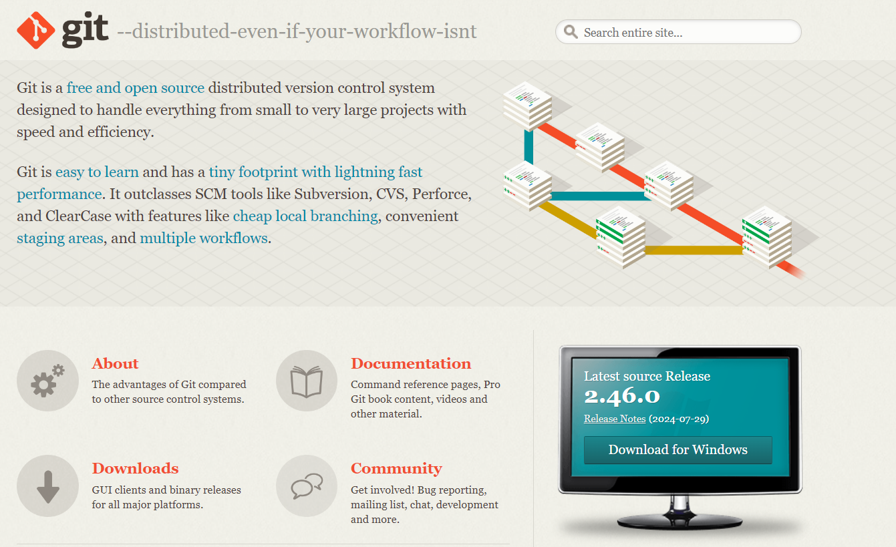+

پس از اتمام نصب، می‌توانید با استفاده از خط فرمان ویندوز(CMD) – (PowerShell) وGit Bash  نصب شده و در سیستم عامل لینوکس از ترمینال اجرا و نصب گیت را بررسی کنید.

برای بررسی نصب شدن گیت کافیست وارد خط فرمان (CMD) و یا (PowerShell) و در لینوکس وارد ترمینال شده و دستورgit  را تایپ کنید و Enter را فشار دهید.

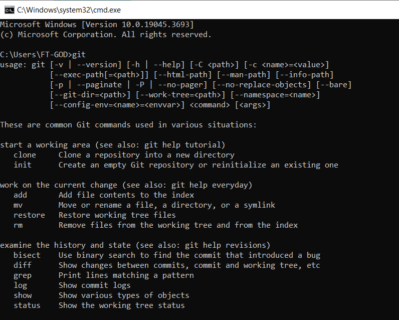+

### **دستورات سطح پایه Git**

در بخش اول دستورات پایه Git را یاد خواهید گرفت. این دستورات، پایه و اساس یادگیری دستورات پیشرفته تر هستند.

در اینجا 9 دستور کاربردی گیت آورده شده است:

دستور git config بسیار مفید است به خصوص وقتی برای اولین بار از گیت استفاده می کنید یا یک گیت جدید نصب کرده باشید. این دستور هویت شما را با نام و آدرس ایمیل تنظیم می کند. بعد از این هر اطلاعات یا تغییری با این اعتبار ثبت خواهد شد.

تنظیم نام:

```plaintext
git config –global user.name “Your name”
```

تنظیم ایمیل:

```plaintext
git config –global user.email “Your email”
```

### **git version**

همانطور که از اسمش مشخصه برای بررسی نسخه Git استفاده می شود. در نسخه های جدیدتر می توانید از git -v استفاده کنید.

```plaintext
git version
```

### **git init**

**احتمالاً اولین دستوری است که برای شروع یک پروژه جدید در Git استفاده می کنید. این دستور یک مخزن خالی جدید ایجاد می کند که در ادامه می توانید کد منبع خود را در داخل آن ذخیره کنید.**

```plaintext
git init
```

همچنین می توانید نام مخزن را در دستور git init بیاورید.

```plaintext
git init <your repository name>
```

### **git clone**

از دستور git clone برای کپی یک مخزن موجود استفاده می شود. یک تفاوت اساسی بین git init و git clone وجود دارد.

```plaintext
git clone <your project URL>
```

### **git status**

از دستو git  status برای مشاهده وضعیت تغییرات انجام شده فایل ها استفاده می گردد، به وسیله ای این دستور می توانید فهرست فایل هایی که اضافه – حذف و یا دچار تغییر شده اند را مشاهده نمایید.

می توانید از آن در بین دستورات Git add و Git commits برای دیدن وضعیت استفاده کنید.

```plaintext
git status
```

### **git add**

دستور git add همه فایل های جدید کد یا فایل های ویرایش شده را به مخزن اضافه می کند. این دستور گزینه های مختلفی را برای اضافه کردن فایل ها و پوشه ها ارائه می دهد.

دستور زیر یک فایل خاص را به ناحیه stage اضافه می کند.

```plaintext
git add your_file_name
```

دستور زیر همه فایل های ویرایش شده و جدید را به ناحیه stage اضافه می کند.

```plaintext
$ git add *
```

### **git commit**

این یک دستور ضروری در Git است. در واقع دستور git commit تغییرات را به مخزن محلی اضافه خواهد کرد.

```plaintext
git commit -m “your useful commit message”
```

### **git branch**

**اغلب چند شاخه در مخزن Git وجود دارد. شاخه یا branch یک خط مستقل از توسعه کد است.**

**با دستور git branch می توانید شاخه ها را به طور موثر مدیریت کنید. گزینه ها و سوئیچ های مختلفی از Git branch وجود دارد.**

لیست کردن همه شاخه ها

```plaintext
git branch
```

ساخت یک شاخه جدید

```plaintext
git branch <branch_name>
```

حذف یک شاخه

```plaintext
git branch -d <branch_name>
```

### **git checkout**

از این دستور برای جابجایی بین شاخه ها استفاده می شود. یکی از دستورات قدرتمند git است و می تواند به عنوان یک ابزار چند منظوره استفاده شود.

رفتن به شاخه دیگر:

```plaintext
git checkout <branch_name>
```

همچنین می توانید یک شاخه جدید بسازید و روی آن سوییچ کنید.

```plaintext
git checkout -b <your_new_branch_name>
```

## **دستورات سطح متوسط ​​ Git**

بعد از دستورات پایه دستورات سطح متوسط Git ​​را بررسی می کنیم. این دستورات برای همکاری با تیم و به اشتراک گذاری کد خود با دیگران بسیار مفید هستند. دستورات دیگری مانند ورود به سیستم نیز وجود دارد که به شما کمک می کند تاریخچه commitهای قبلی را مشاهده کنید.

### **git remote**

```plaintext
git remote add <shortname> <url>
```

**مثال**

```plaintext
git remote add origin https://dev.azure.com/aCompiler/_git/DemoProject
```

### **git push**

پس از اتصال به مخزن از راه دور (با کمک دستور git remote) وقتشه که تغییرات را به مخزن بفرستید.

```plaintext
git push -u <short_name> <your_branch_name>
```

مثال

```plaintext
git push -u origin feature_branch
```

باید قبل از استفاده از دستور git push منبع و قسمت بالایی Git تنظیم شود.

```plaintext
git push –set-upstream <short_name> <branch_name>
```

مثال

```plaintext
git push –set-upstream origin feature_branch
```

### **git fetch**

در صورت نیاز به دانلود سایر تغییرات اعضای تیم یا دیگر مخزن ها باید از دستور git fetch استفاده کنید.

این دستور همه اطلاعات مربوط به commitها، رفرنس ها و … را دانلود می کند بنابراین می توانید قبل از اعمال این تغییرات در مخزن محلی خود آنها را مرور کنید.

```plaintext
git fetch
```

### **git pull**

دستور git pull محتوا را دانلود کرده (نه متاداده ها) و بلافاصله مخزن محلی را با جدیدترین مطالب به روزرسانی می کند.

```plaintext
git pull <remote_url>
```

### **git stash**

این دستور فایل های ویرایش شده را به طور موقت ذخیره می کند. stash در لغت به معنی ذخیره کردن است. در گیت نیز هر چیزی که کامیت نشده رو ذخیره می کند.

می توانید با دستور git stash به صورت زیر کار کنید.

```plaintext
git stash
```

دستور زیر همه stashهای را لیست می کند.

```plaintext
git stash list
```

به سادگی یک stash به شاخه اعمال می کند.

```plaintext
git stash apply
```

### **git log**

با کمک دستور git log می توانید همه کامیت های قبلی با شروع از آخرین کامیت را مشاهده کنید.

```plaintext
git log
```

به طور پیشفرض همه کامیت های شاخه فعلی را نشان می دهد اما می توانید از آن برای دیدن همه کامیت های کل شاخه ها با همه گزینه ها استفاده کنید.

```plaintext
git log –all
```

### **git shortlog**

دستور git shortlog خلاصه ای از دستور git log را نشان می دهد. اگر فقط علاقه یا نیاز به یک خلاصه کوتاه دارید، این یک دستور مفید است.

این دستور برای دیدن اینکه چه کسی روی چه چیزی کار کرده نیز کاربرد دارد.

```plaintext
git shortlog
```

### **git show**

در مقایسه با دستور git log، دستور git show جزئیات مربوط به یک کامیت خاص را نشان می دهد.

```plaintext
git show <your_commit_hash>
```

### **git rm**

بعضی اوقات باید چند فایل را حذف کنید، در اینجا از دستور Git rm استفاده می شود.

این دستور می تواند فایل های ردیابی شده را از ایندکس و دایرکتوری کار حذف کند.

```plaintext
git rm <your_file_name>
```

### **git merge**

دستور git merge کمک می کند تا تغییرات از دو شاخه را در یک شاخه واحد ادغام کنید.

```plaintext
git merge <branch_name>
```

## **دستورات سطح پیشرفته Git**

یک سطح جلوتر می رویم. در این بخش با دستورات پیشرفته Git آشنا خواهید شد. این دستورات به زمان و تمرین بیشتری نیاز دارند اما وقتی اصول آنها را یاد بگیرید استفاده از آنها آسانتر خواهد شد.

### **git rebase**

git rebase شبیه دستور git merge است. دو شاخه را با یک استثنا در یک شاخه واحد ادغام می کند. یک دستور git rebase تاریخچه کامیت را بازنویسی می کند.

اگر چند شاخه خصوصی دارید باید از دستور git rebase برای ادغام در یک شاخه استفاده کنید. این باعث می شود که یک تاریخچه کامیت خطی بسازید.

```plaintext
git rebase <base>
```

### **git bisect**

دستور git bisect کمک می کند تا کامیت های بد را پیدا کنید.

: شروع git bisect

```plaintext
git bisect start
```

: به git bisect درباره یک کامیت خوب اطلاع دهید.

```plaintext
git bisect good a123
```

: به git bisect درباره یک کامیت بد اطلاع دهید.

```plaintext
git bisect bad z123
```

با استفاده از git bisect می توانید کد خراب را در عرض چند دقیقه تعیین کرده و میزان کدهای خراب را کم کنید.

### **git cherry-pick**

git cherry-pick یک دستور مفید و قوی است که امکان انتخاب هر کامیتی را از هر شاخه و اعمال آن به هر شاخه دیگری را فراهم می کند.

```plaintext
git cherry-pick <commit-hash>
```

### **git archive**

```plaintext
git archive –format zip HEAD > archive-HEAD.zip
```

یک فایل zip از بازبینی فعلی ایجاد می کند.

### **git pull –rebase**

بیشتر مواقع هنگام استفاده از git pull باید rebase (نه ادغام یا merge) انجام دهید.

در این صورت می توانید از گزینه زیر استفاده کنید.

```plaintext
git pull –rebase
```

این کمک می کند تا تاریخچه را تمیز نگه دارید. همچنین از ادغام های متعدد جلوگیری می کند.

### **git blame**

برای بررسی سطر به سطر محتوای هر فایل از دستور git blame استفاده کنید. این دستور کمک می کند تا تشخیص دهید چه کسی تغییرات را در یک فایل ایجاد کرده است.

```plaintext
git blame <your_file_name>
```

### **git tag**

در Git تگ ها مفید هستند و می توانید از آنها برای مدیریت انتشار استفاده کنید. می توانید تگ را مانند یک شاخه بدون تغییر در نظر بگیرید. اهمیت آن هنگام انتشار عمومی خیلی بیشتری است. از دستور git tag برای ایجاد یک تگ جدید استفاده می شود.

```plaintext
git tag -a v1.0.0
```

### **git verify-commit**

دستور git verify-commit امضای gpg کامیت ها را بررسی می کند. GPG یا “GNU Privacy Guard” است.

```plaintext
git verify-commit <commit>
```

### **git verify-tag**

با این دستور می توانید تگ را تأیید کنید.

```plaintext
git verify-tag <tag>
```

### **git diff**

بیشتر اوقات قبل از commit یا push باید دو فایل یا شاخه git را با هم مقایسه کنید. دستور مفید git diff برای این کار استفاده می شود.

: مقایسه دایرکتوری کاری با مخزن محلی:

```plaintext
git diff HEAD <filename>
```

: مقایسه دو شاخه:

```plaintext
git diff <source branch> <target branch>
```

### **git citool**

git citool یک جایگزین گرافیکی برای کامیت Git است.

```plaintext
git citool
```

### **git mv**

دستور git mv برای تغییر نام فایل git استفاده می شود. دو آرگومان دارد؛ نام فایل منبع و مقصد.

```plaintext
git mv <old-file-name> <new-file-name>
```

### **git clean**

با استفاده از دستور git clean می توانید با فایل های ردیابی نشده (untracked) کار کنید. با این دستور می توانید همه فایل های ردیابی نشده را از دایرکتوری کار حذف کنید. برای کار با فایل های ردیابی شده (tracked) باید از دستور git reset استفاده کنید.

```plaintext
git clean
```

### **git help**

دستورات زیادی در Git وجود دارد، برای به دست آوردن اطلاعات و راهنمایی بیشتر برای هر دستور می توانید از دستور git help در هر زمان از ترمینال استفاده کنید.

```plaintext
git help <git_command>
```

### **git whatchanged**

دستور git whatchanged همان کار git log را انجام می دهد اما در قالب خام.

```plaintext
git whatchanged
```

## **مثال کاربردی ایجاد مخزن**

مثال کاربردی درخصوص ایجاد یک مخزن جدید در گیت هاب: 

پس از ثبت نام و وارد شدن به ناحیه کاربری در سایت گیت هاب (https://github.com) برای ایجاد یک پروژه جدید به آدرس (https://github.com/new) و یا بعداز وارد شدن به صفحه‌ی گیت هاب خورد از طریق دکمه‌ی New وارد صفحه ایجاد مخزن جدید شوید.

روی دکمه New کلیک کنید.

**+**

**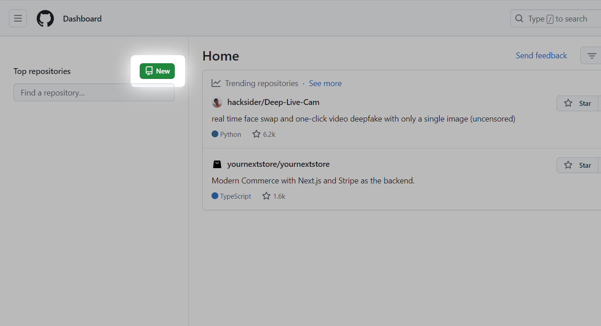+**

اطلاعات مورد نظر را وارد کنید.

**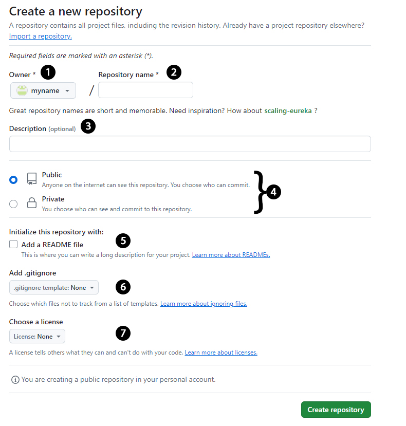**

**توضیحات فیلد ها:**

1.  مالک مخزن، که طبعا خودتان هستید.
2.  نام مخزن، یک نام خاص برای مخزن جدید وارد کنید که قبلا توسط شما انتخاب نشده باشد. (اجباری)
3.  توضیحاتی برای مخزن جدید وارد کنید (اختیاری)
4.  دسته بندی دسترسی به مخزن، بصورت Public (عمومی : مشاهده توسط تمامی کاربران ) یا خصوصی Private مشاهده فقط توسط خودتان.
5.  افزودن فایل README به مخزن (اختیاری)
6.  افزودن فایل .gitignore به مخزن (اختیاری)
7.  انتخاب لایسنس برای مخزن (اختیاری)

و در انتها جهت ساخت مخزن جدید رو دکمه Create repository کلیک کنید.

تبریک، مغزن جدید با موفقیت ساخته شد.

پس از ایجاد مخزن جدید به صفحه جدید به نام مخزن ایجاد شده وارد می شوید که اطلاعات آن را می توان مشاهده کرد و از دستورات موجود برای ارتباط و عملیات های مذکور استفاده کرد. 

**+**

**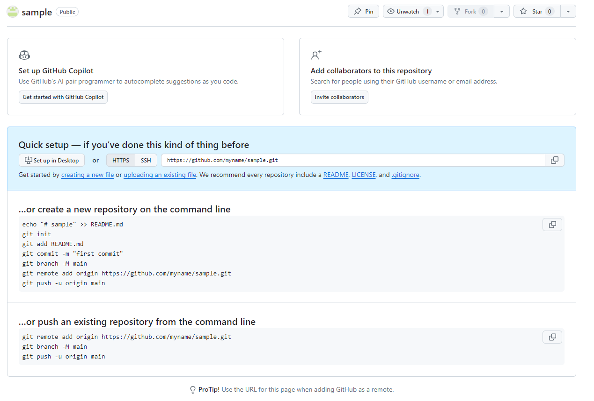+**

در ادامه مثال می خواهیم در سیستم خود یک پوشه با نام دلخواه ایجاد کنیم، و در آن یک فایل HTML قرار داده و به مخزن خود ارسال کنیم تا در آن ذخیره شود.

**+**

**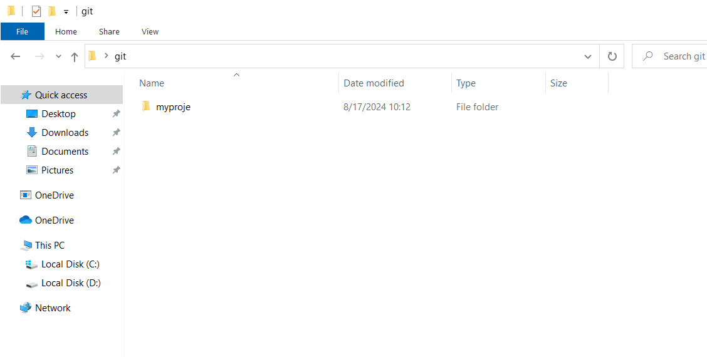+**


وارد پوشه ایجاد شده شوید.

در نسخه های ویندوز جدید می توانید ازPower Shell  استفاده کنید و یا برای استفاده از خط فرمان بوسیله کلید های ترکیبی R + WIN پنجره ران را اجرا و دستور CMD را بنویسید و اینتر کنید تا پنجره خط فرمان اجرا گردد، و بوسیله دستور CD به مسیر فولدر ایجاد شده وارد شود. همچنین می توانید با راست کلیک کردن در پوشه ایجاد شده از رابط کابری  Git GUI و Git Bash استفاده کنید. 

**+**

**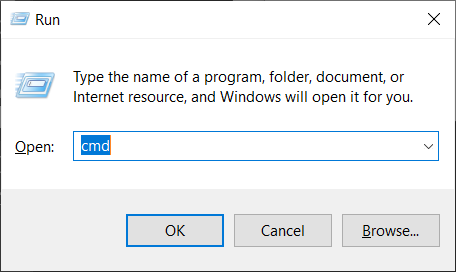+**


**+**

**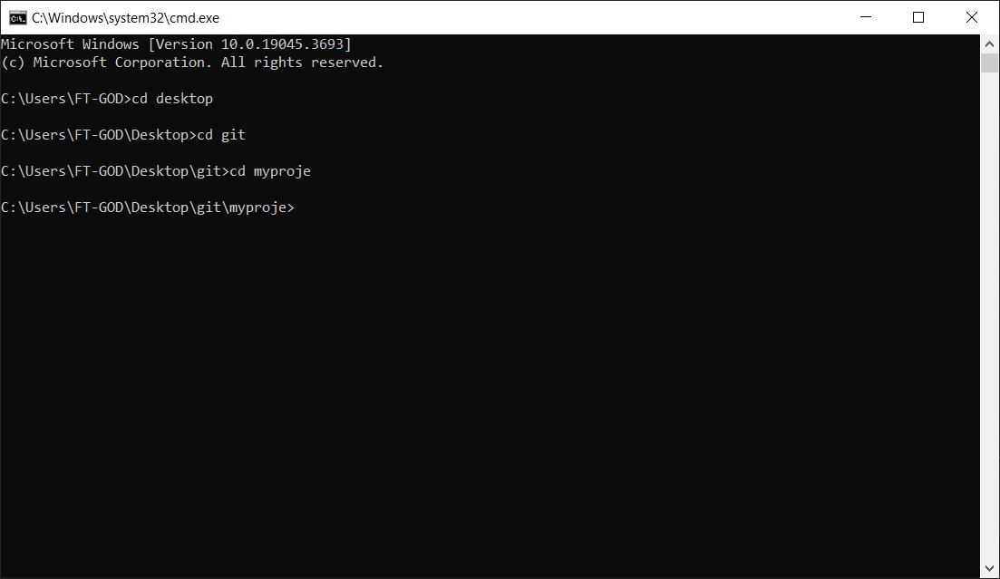+**


**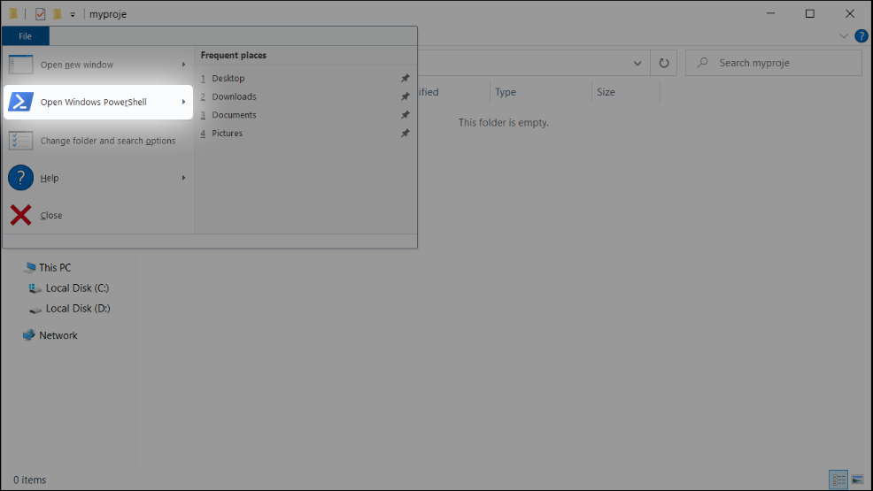+**

**+**

**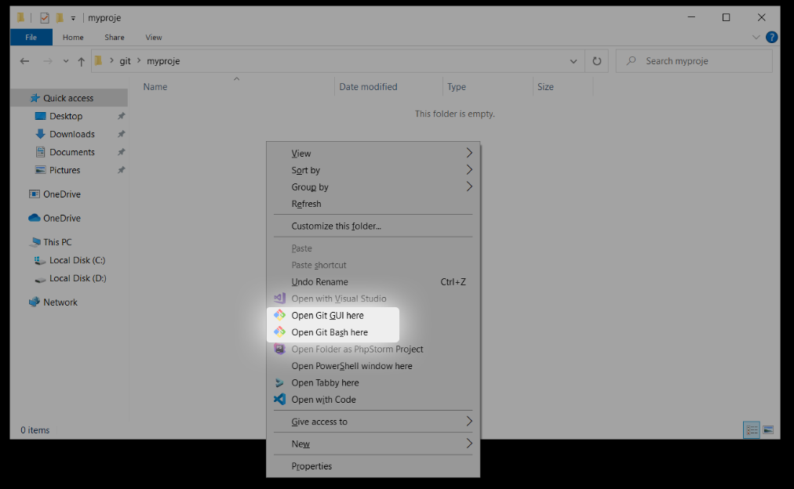+**

**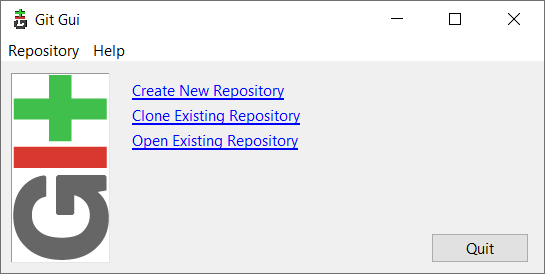+**

**+**

**+**

**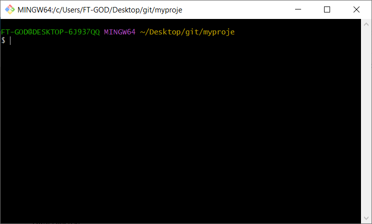+**

**+**

**+**

ویا از طریق راه های دیگر و نرم افزار های جانبی می توانید به خط فرمان دسترسی و وارد مسیر پروژه خود شوید.

در مرحله ی بعد دستور + را وارد کنید تا اطلاعات و کانفیگ پایه گیت ایجاد گردد :

```plaintext
git init
```

**+**

**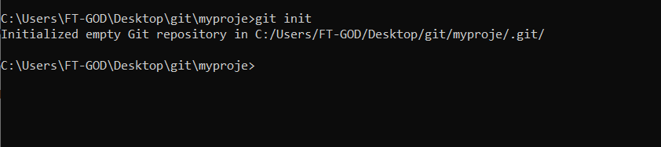+**

پس از اجرای این دستور یک پوشه ( درحالت مخفی ) ایجاد می گردد که شامل محتویات و فایل های مربوط به گیت است که نباید حذف شود. 

**+**

**++**

**++**

در ادامه یک فایل با فرمت دلخواه ایجاد می کنیم: 

**+**

**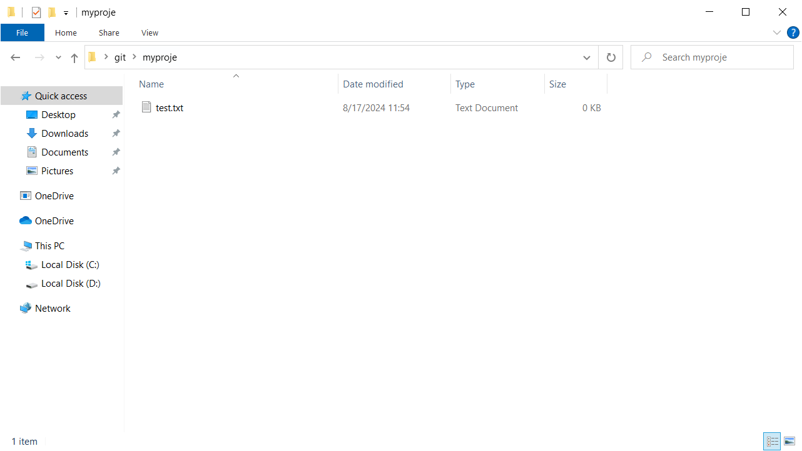+**

**+**

در خط فرمان دستور git status را وارد کرده و نتیجه را مشاهده خواهید کرد که فایل جدید اضافه گردیده است.

فایل های اضافه شده و ویرایش شده به رنگ قرمز می باشند.

نتیجه: 

**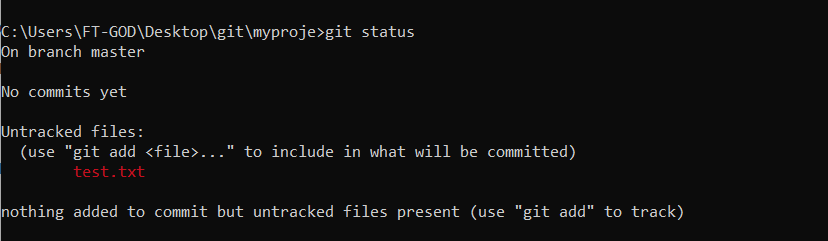+**

**+**

دستور git add \* را برای افزودن تمامی فایل های جدید و ویرایش شده را برای آماده سازی جهت ارسال به مزن وارد می گردد.

برای دیدن نتیجه عملیات دوباره دستور git status را وارد می کنیم و اینتر.

فایل هایی که با موفقیت آماده ارسال به مخزن هستند به رنگ سبز مشخص گردیده اند.

نتیجه:

**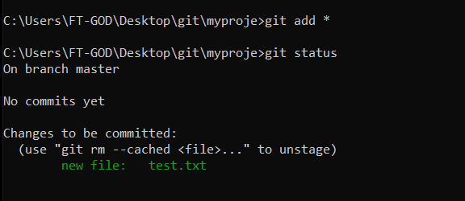+**

**+**

**+**

دستور git commit را به همراه یک توضیح ( کامنت ) وارد کرده و اینتر را میزنیم. 

دستور کامل : 

```plaintext
git commit -m “Matne Nemone”
```

نتیجه:

**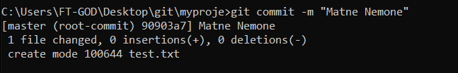**

**+**

**دستور git branch را برای انتخاب برنچ main وارد می کنیم.**

**دستور کامل:** 

```plaintext
git branch -M main
```

**نتیجه:** 

**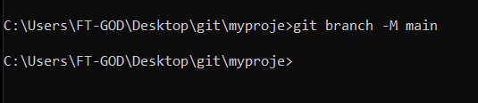+**

**+**

دستور git remote را جهت اتصال به مخزن ایجاد شده وارد می کنیم، در صورتی که مخزن ایجاد شده بصورت Private (خصوصی) باشد می بایست نام کاربری و پسورد خود را جهت اتصال امن وارد کنید.

دستور نمونه: 

```plaintext
git remote add origin “Your Repository Address” 
```

دستور کامل و مثال: 

```plaintext
git remote add origin https://github.com/myname/sample.git
```

نتیجه: 

**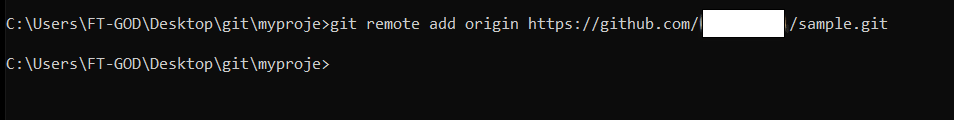**

هم اکنون فایل ایجاد شده با نام test.txt آماده ارسال به مخزن می باشد، برای اینکار کافیست دستور git push وارد کرده و اینتر را میزنیم.

می توانید دستور کوتاه شده یا کامل را وارد کنید.

دستور کوتاه و ارسال به برنچ پیش فرض : 

```plaintext
git push
```

دستور کامل و ارسال به برنچ main : 

```plaintext
git push -u origin main
```

نتیجه : 

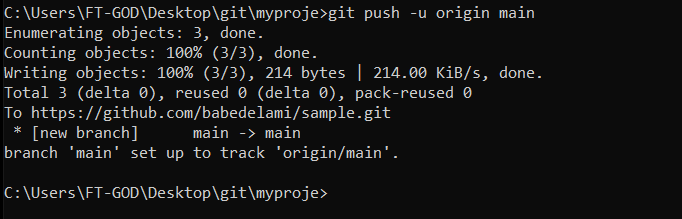+

فایل ایجاد شده با موفقیت به مخزن ایجاد شده در گیت منتقل گردید.

نتیجه:

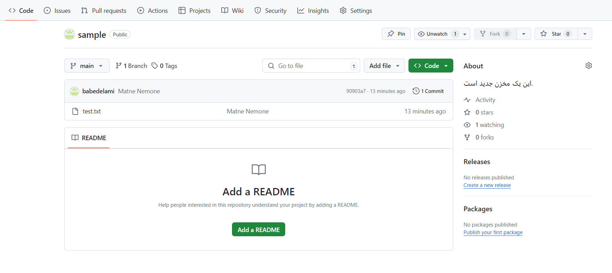+