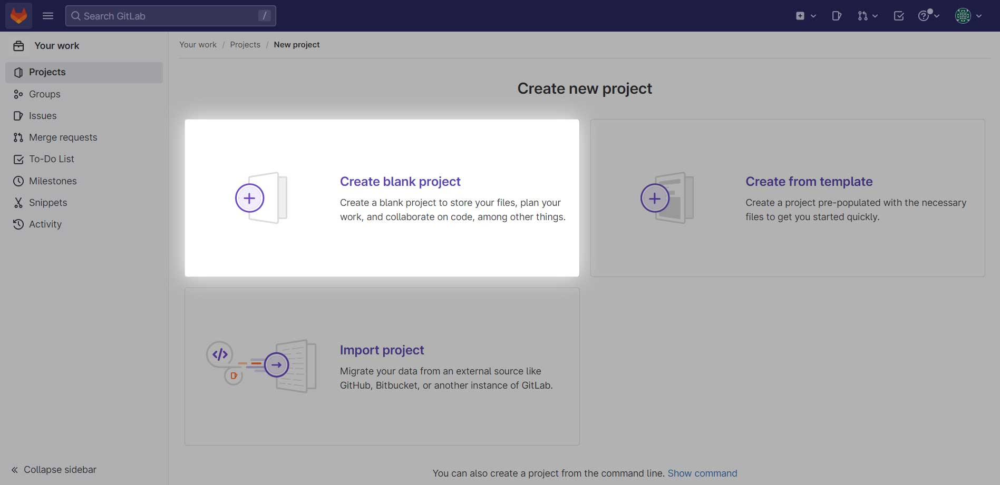
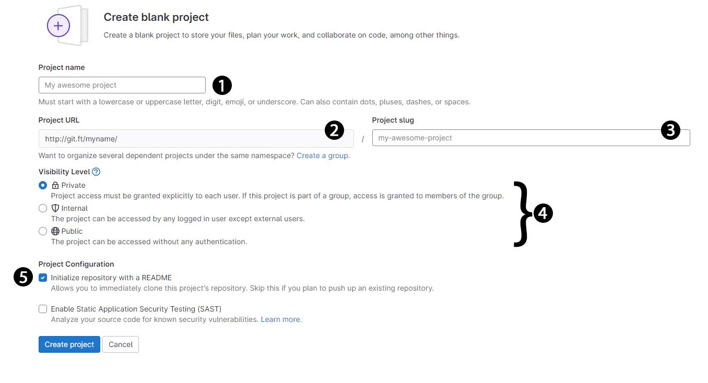
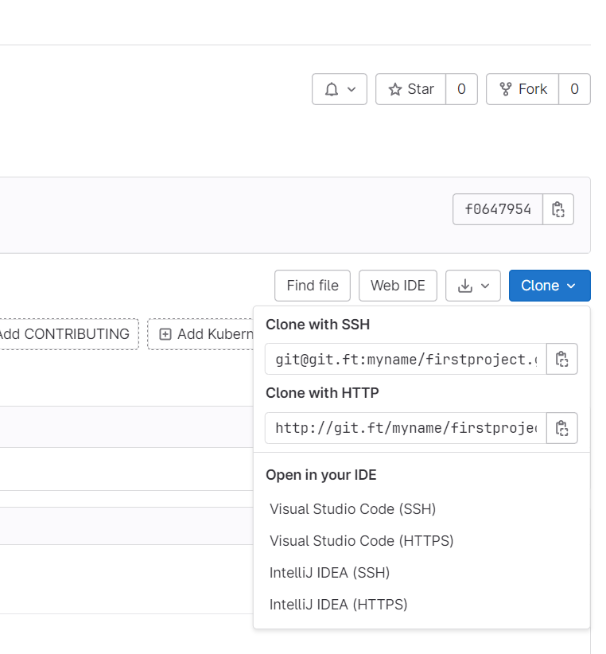

### **گیت چیست؟**

گیت (Git) یکی از محبوب‌ترین سیستم‌های کنترل ورژن (VSC) توزیع‌شده و متن‌باز جهان است که در سال ۲۰۰۵، لینوس توروالدز (Linus Torvalds)، خالق هسته سیستم‌عامل لینوکس، آن را ایجاد کرد. Git بیشتر برای ردیابی تغییرات فایل‌های پروژه به‌کار برده می‌شود. تعداد بسیار زیادی از پروژه‌های دنیا از سیستم گیت برای کنترل ورژن نرم‌افزارهای خود استفاده می‌کنند. همچنین، گیت روی بسیاری از سیستم‌عامل‌ها و IDE ها به‌طور پیش‌فرض وجود دارد که می‌توانید از آن استفاده کنید.

هر نسخه از گیت، مخزنی شامل تاریخچه کامل تغییرات سورس مدنظر است. Git بسیار سریع و ایمن است که به توسعه پروژه‌های تیمی کوچک‌ و‌ بزرگ کمک می‌کند. گیت باتوجه‌ به امکانات و ویژگی‌ هایش، بهترین انتخاب برای اکثر تیم‌های نرم‌افزاری است. Git پایه بسیاری از سرویس‌ها مانند گیت‌ هاب (GitHub) و گیت‌لب (GitLab) است.

### **سیستم کنترل ورژن چیست؟**

سیستم کنترل ورژن (Version Control System به‌اختصار VCS) که به‌عنوان سیستم مدیریت سورس (SCM) نیز شناخته می‌شود، وظیفه مدیریت و ردیابی تغییرات در کدهای پروژه را برعهده دارد. سیستم‌ های کنترل ورژن ابزارهایی هستند که به برنامه‌نویسان کمک می‌کنند تا تغییرات کدهای پروژه را در طول زمان در اختیار داشته باشند و هر زمان که نیاز داشتند، بتوانند کدهای نسخه‌های قبل را بازیابی کنند.

سیستم کنترل ورژن هر تغییری در کد را در نوع خاصی از پایگاه‌داده ثبت می‌کند. اگر اشتباهی در کدهای پروژه رخ دهد، برنامه‌نویسان می‌توانند به کدهای گذشته دسترسی داشته باشند و نسخه‌های قبلی کد را با‌هم مقایسه و باگ را رفع کنند. سیستم‌های کنترل ورژن در نسخه‌های زیادی وجود دارند که گیت یکی از معروف‌ترین آن‌هاست.

### **آشنایی با گیت هاب**

گیت‌ هاب ([GitHub](https://github.com/)) سرویس میزبانی برای مخازن گیت است و تحت‌وب ارائه می‌شود. با استفاده از گیت‌ هاب، می‌توانید مخازن گیت خود را به‌ راحتی به ‌اشتراک بگذارید و کارهای تیمی‌تان را به بهترین نحو ممکن مدیریت کنید. به‌عبارت‌ دیگر،GitHub مکانی است که در آن، تمامی کارهای مدیران پروژه و برنامه‌نویسان ثبت و ذخیره می‌شوند و در‌نهایت، عملیات‌های پروژه کاملاً واضح باقی می‌مانند.

*   مخازن گیت را می‌توان به‌صورت خصوصی و درون‌تیمی یا به‌صورت عمومی برای همه ذخیره کرد.
*   فایل‌های خود را به‌راحتی می‌توانید از گیت‌ هاب دریافت کنید.
*   GitHub همه افراد را سازمان‌دهی و هماهنگ می‌کند.
*   ابزارهای متفاوت گیت به تیم‌ها کمک می‌کند تا کارهای خود را سریع‌تر و بهتر پیش ببرند.

### **آشنایی با گیت لب**

«گیت لب» (gitlab) یک پلتفرم و مخزن گیت مبتنی بر وب است که به برنامه‌نویسان و توسعه‌دهندگان امکان کدنویسی، برنامه‌ریزی، آزمایش و رفع اشکال کدها و غیره را به شکلی هماهنگ و مشترک فراهم می‌کند تا فرایند تولید محصول (به اصطلاح چرخه تولید) کاهش یابد و با داشتن بازدهی بیشتر، محصولی بهینه، با کیفیت و هوشمندانه‌تری تولید شود. پلتفرم گیت لب خدمات خود را به دو شکل رایگان و پولی ارائه می‌دهد تا همه افراد بتوانند از این سرویس در تمامی مراحل توسعه برنامه استفاده کنند.


### **کارایی گیت**

گیت از بسیاری از سیستم‌های کنترل ورژن (VCS) مشابه مانند CVS و SVN و Mercurial قوی‌تر است. انجام تغییرات جدید، شاخه‌بندی، ادغام و مقایسه نسخه‌های قبلی همگی برای مدیریت پروژه شما دردسترس هستند. گیت از سیستم توزیع خوشه‌ای یا درختی استفاده می‌کند. برخلاف برخی از نرم‌افزارهای کنترل ورژن، Git هنگام ذخیره تاریخچه و نسخه‌های فایل، نام فایل‌ها را در نظر نمی‌گیرد و روی محتوای فایل متمرکز است. همچنین، مخزن گیت از ترکیب رمزگذاری دلتا برای ذخیره تفاوت‌های کد استفاده و درادامه با فشرده‌سازی، فایل‌ها را کاملاً ذخیره می‌کند.

### **چرخه عملکرد گیت چگونه است؟**

1.  قبل از ثبت تغییرات، آن‌ها را بررسی می‌کنید.
2.  تغییرات را ثبت (Commit) می‌کنید.
3.  اگر متوجه شدید مشکلی رخ داده است، آخرین Commit را بازیابی می‌کنید.

### **مفاهیم مطرح در گیت هاب**

>  **Repository Repository** را می‌توان منبع و یا مخزن تعریف کرد. در واقع مخزن مکانی است که تمام فایل‌های یک پروژه در آن ذخیره می‌شود. هر پروژه دارای مخزن خود است که با آدرس URL در دسترس خواهد بود.

>  **Fork** کلمه Fork را در فارسی میتوان معادل شعبه و یا شاخه دانست. این کلمه زمانی به کار می‌رود که می‌خواهید پروژه‌ای را بر اساس یک پروژه‌ی دیگر که از قبل موجود است ایجاد کنید. شما با استفاده از این ویژگی می‌توانید پروژه‌ای را که از قبل وجود دارد، برای خود منشعب کنید و اگر منبع اولیه‌ به‌روزرسانی شود، این به‌روزرسانی‌ها به‌راحتی به انشعاب نیز اضافه خواهد شد.

>  **Commit** به‌ زبان ساده، هر تغییر یک Commit نامیده می‌شود که هر یک از آن‌ها شامل یک توصیف برای علت ایجاد این تغییر است.

>   **Pull Request** معادل فارسی این مفهوم «درخواست ادغام یا یکپارچگی» است. این درخواست زمانی به کار می‌رود که شما تغییراتی در یک پروژه (منشعب شده) انجام داده‌اید، ولی می‌خواهید این تغییرات توسط برنامه‌نویسان اصلی شناخته شده و در پروژه (repo) اولیه قرار بگیرد.

**شبکه‌ اجتماعی**  هر کاربر در گیت هاب یک پروفایل و یک رزومه مخصوص به خودش دارد که آثار پیشین و همکاری‌هایی را که توسط درخواست‌های ادغام انجام داده است، نشان می‌دهد. بازبینی در پروژه‌ها را می‌توان به‌صورت عمومی مورد بحث قرار داد و در واقع میتوان از ویژگی اجتماعی بودن آن استفاده کرد.

### **استفاده از گیت**


**نصب برنامه مورد نیاز**

ابتدا  باید  آخرین نسخه‌ی برنامه Git را بنابر سیستم عامل مورد استفاده خود از وب سایت رسمی آن دانلود و نصب کرد، برای اینکار کافیست به وب سایت [https://git-scm.com](https://git-scm.com) مراجعه کنید.


پس از اتمام نصب، می‌توانید با استفاده از خط فرمان ویندوز (CMD) – (PowerShell) و Git Bash نصب شده و در سیستم عامل لینوکس از ترمینال اجرا و نصب گیت را بررسی کنید.

برای بررسی نصب شدن گیت کافیست وارد خط فرمان (CMD) و یا (PowerShell) و در لینوکس وارد ترمینال شده و دستور **git** را تایپ کنید و Enter را فشار دهید.


### **دستورات سطح پایه Git**

در بخش اول دستورات پایه Git را یاد خواهید گرفت. این دستورات، پایه و اساس یادگیری دستورات پیشرفته تر هستند.

در اینجا 9 دستور کاربردی گیت آورده شده است:

دستور **git config** بسیار مفید است به خصوص وقتی برای اولین بار از گیت استفاده می کنید یا یک گیت جدید نصب کرده باشید. این دستور هویت شما را با نام و آدرس ایمیل تنظیم می کند. بعد از این هر اطلاعات یا تغییری با این اعتبار ثبت خواهد شد.

تنظیم نام:

```bash
git config –global user.name “Your name”
```

تنظیم ایمیل:

```plaintext
git config –global user.email “Your email”
```

### **git version**

همانطور که از نامش مشخص است برای بررسی نسخه Git استفاده می شود. در نسخه های جدیدتر می توانید از git -v استفاده کنید.

```plaintext
git version
```

### **git init**

احتمالاً اولین دستوری است که برای شروع یک پروژه جدید در Git استفاده می کنید. این دستور یک مخزن خالی جدید ایجاد می کند که در ادامه می توانید کد منبع خود را در داخل آن ذخیره کنید.

```plaintext
git init
```

همچنین می توانید نام مخزن را در دستور git init بیاورید.

```plaintext
git init <your repository name>
```

### **git clone**

از دستور **git clone** برای کپی یک مخزن موجود استفاده می شود. یک تفاوت اساسی بین git init و git clone وجود دارد.

```plaintext
git clone <your project URL>
```

### **git status**

از دستو **git  status** برای مشاهده وضعیت تغییرات انجام شده فایل ها استفاده می گردد، به وسیله ای این دستور می توانید فهرست فایل هایی که اضافه – حذف و یا دچار تغییر شده اند را مشاهده نمایید.

می توانید از آن در بین دستورات Git add و Git commits برای دیدن وضعیت استفاده کنید.

```plaintext
git status
```

### **git add**

دستور **git add** را برای افزودن تمامی فایل های جدید و ویرایش شده را برای آماده سازی جهت ارسال به مخزن وارد می گردد.

دستور زیر یک فایل خاص را به ناحیه stage اضافه می کند.

```plaintext
git add your_file_name
```

دستور زیر همه فایل های ویرایش شده و جدید را به ناحیه stage اضافه می کند.

```plaintext
$ git add *
```

### **git commit**

این یک دستور ضروری در Git است. در واقع دستور **git commit** تغییرات را به مخزن محلی اضافه خواهد کرد.

```plaintext
git commit -m “your useful commit message”
```

### **git branch**

اغلب چند شاخه در مخزن Git وجود دارد. شاخه یا branch یک خط مستقل از توسعه کد است.

با دستور **git branch** می توانید شاخه ها را به طور موثر مدیریت کنید. گزینه ها و سوئیچ های مختلفی از Git branch وجود دارد.

لیست کردن همه شاخه ها

```plaintext
git branch
```

ساخت یک شاخه جدید

```plaintext
git branch <branch_name>
```

حذف یک شاخه

```plaintext
git branch -d <branch_name>
```

### **git checkout**

از این دستور برای جابجایی بین شاخه ها استفاده می شود. یکی از دستورات قدرتمند git است و می تواند به عنوان یک ابزار چند منظوره استفاده شود.

رفتن به شاخه دیگر:

```plaintext
git checkout <branch_name>
```

همچنین می توانید یک شاخه جدید بسازید و روی آن سوییچ کنید.

```plaintext
git checkout -b <your_new_branch_name>
```

### **دستورات سطح متوسط ​​ Git**

بعد از دستورات پایه دستورات سطح متوسط Git ​​را بررسی می کنیم. این دستورات برای همکاری با تیم و به اشتراک گذاری کد خود با دیگران بسیار مفید هستند. دستورات دیگری مانند ورود به سیستم نیز وجود دارد که به شما کمک می کند تاریخچه commit های قبلی را مشاهده کنید.

### **git remote**

```plaintext
git remote add <shortname> <url>
```

**مثال**

```plaintext
git remote add origin https://dev.azure.com/aCompiler/_git/DemoProject
```

### **git push**

پس از اتصال به مخزن از راه دور (**با کمک دستور git remote**) وقتشه که تغییرات را به مخزن بفرستید.

```plaintext
git push -u <short_name> <your_branch_name>
```

مثال

```plaintext
git push -u origin feature_branch
```

باید قبل از استفاده از دستور **git push** منبع و قسمت بالایی Git تنظیم شود.

```plaintext
git push –set-upstream <short_name> <branch_name>
```

مثال

```plaintext
git push –set-upstream origin feature_branch
```

### **git fetch**

در صورت نیاز به دانلود سایر تغییرات اعضای تیم یا دیگر مخزن ها باید از دستور **git fetch** استفاده کنید.

این دستور همه اطلاعات مربوط به commitها، رفرنس ها و … را دانلود می کند بنابراین می توانید قبل از اعمال این تغییرات در مخزن محلی خود آنها را مرور کنید.

```plaintext
git fetch
```

### **git pull**

دستور **git pull** محتوا را دانلود کرده (نه متاداده ها) و بلافاصله مخزن محلی را با جدیدترین مطالب به روزرسانی می کند.

```plaintext
git pull <remote_url>
```

### **git stash**

این دستور فایل های ویرایش شده را به طور موقت ذخیره می کند. stash در لغت به معنی ذخیره کردن است. در گیت نیز هر چیزی که کامیت نشده رو ذخیره می کند.

می توانید با دستور **git stash** به صورت زیر کار کنید.

```plaintext
git stash
```

دستور زیر همه stashهای را لیست می کند.

```plaintext
git stash list
```

به سادگی یک stash به شاخه اعمال می کند.

```plaintext
git stash apply
```

### **git log**

با کمک دستور **git log** می توانید همه کامیت های قبلی با شروع از آخرین کامیت را مشاهده کنید.

```plaintext
git log
```

به طور پیشفرض همه کامیت های شاخه فعلی را نشان می دهد اما می توانید از آن برای دیدن همه کامیت های کل شاخه ها با همه گزینه ها استفاده کنید.

```plaintext
git log –all
```

### **git shortlog**

دستور **git shortlog** خلاصه ای از دستور **git log** را نشان می دهد. اگر فقط علاقه یا نیاز به یک خلاصه کوتاه دارید، این یک دستور مفید است.

این دستور برای دیدن اینکه چه کسی روی چه چیزی کار کرده نیز کاربرد دارد.

```plaintext
git shortlog
```

### **git show**

در مقایسه با دستور **git log**، دستور **git show** جزئیات مربوط به یک کامیت خاص را نشان می دهد.

```plaintext
git show <your_commit_hash>
```

### **git rm**

بعضی اوقات باید چند فایل را حذف کنید، در اینجا از دستور **git rm** استفاده می شود.

این دستور می تواند فایل های ردیابی شده را از ایندکس و دایرکتوری کار حذف کند.

```plaintext
git rm <your_file_name>
```

### **git merge**

دستور **git merge** کمک می کند تا تغییرات از دو شاخه را در یک شاخه واحد ادغام کنید.

```plaintext
git merge <branch_name>
```

## **دستورات سطح پیشرفته Git**

یک سطح جلوتر می رویم. در این بخش با دستورات پیشرفته Git آشنا خواهید شد. این دستورات به زمان و تمرین بیشتری نیاز دارند اما وقتی اصول آنها را یاد بگیرید استفاده از آنها آسانتر خواهد شد.

### **git rebase**

git rebase شبیه دستور git merge است. دو شاخه را با یک استثنا در یک شاخه واحد ادغام می کند. یک دستور git rebase تاریخچه کامیت را بازنویسی می کند.

اگر چند شاخه خصوصی دارید باید از دستور git rebase برای ادغام در یک شاخه استفاده کنید. این باعث می شود که یک تاریخچه کامیت خطی بسازید.

```plaintext
git rebase <base>
```

### **git bisect**

دستور git bisect کمک می کند تا کامیت های بد را پیدا کنید.

 شروع git bisect :

```plaintext
git bisect start
```

 به git bisect درباره یک کامیت خوب اطلاع دهید. :

```plaintext
git bisect good a123
```

 به git bisect درباره یک کامیت بد اطلاع دهید. :

```plaintext
git bisect bad z123
```

با استفاده از git bisect می توانید کد خراب را در عرض چند دقیقه تعیین کرده و میزان کدهای خراب را کم کنید.

### **git cherry-pick**

git cherry-pick یک دستور مفید و قوی است که امکان انتخاب هر کامیتی را از هر شاخه و اعمال آن به هر شاخه دیگری را فراهم می کند.

```plaintext
git cherry-pick <commit-hash>
```

### **git archive**

```plaintext
git archive –format zip HEAD > archive-HEAD.zip
```

یک فایل zip از بازبینی فعلی ایجاد می کند.

### **git pull –rebase**

بیشتر مواقع هنگام استفاده از git pull باید rebase (نه ادغام یا merge) انجام دهید.

در این صورت می توانید از گزینه زیر استفاده کنید.

```plaintext
git pull –rebase
```

این کمک می کند تا تاریخچه را تمیز نگه دارید. همچنین از ادغام های متعدد جلوگیری می کند.

### **git blame**

برای بررسی سطر به سطر محتوای هر فایل از دستور git blame استفاده کنید. این دستور کمک می کند تا تشخیص دهید چه کسی تغییرات را در یک فایل ایجاد کرده است.

```plaintext
git blame <your_file_name>
```

### **git tag**

در Git تگ ها مفید هستند و می توانید از آنها برای مدیریت انتشار استفاده کنید. می توانید تگ را مانند یک شاخه بدون تغییر در نظر بگیرید. اهمیت آن هنگام انتشار عمومی خیلی بیشتری است. از دستور git tag برای ایجاد یک تگ جدید استفاده می شود.

```plaintext
git tag -a v1.0.0
```

### **git verify-commit**

دستور git verify-commit امضای gpg کامیت ها را بررسی می کند. GPG یا “GNU Privacy Guard” است.

```plaintext
git verify-commit <commit>
```

### **git verify-tag**

با این دستور می توانید تگ را تأیید کنید.

```plaintext
git verify-tag <tag>
```

### **git diff**

بیشتر اوقات قبل از commit یا push باید دو فایل یا شاخه git را با هم مقایسه کنید. دستور مفید git diff برای این کار استفاده می شود.

 مقایسه دایرکتوری کاری با مخزن محلی :

```plaintext
git diff HEAD <filename>
```

 مقایسه دو شاخه :

```plaintext
git diff <source branch> <target branch>
```

### **git citool**

git citool یک جایگزین گرافیکی برای کامیت Git است.

```plaintext
git citool
```

### **git mv**

دستور git mv برای تغییر نام فایل git استفاده می شود. دو آرگومان دارد؛ نام فایل منبع و مقصد.

```plaintext
git mv <old-file-name> <new-file-name>
```

### **git clean**

با استفاده از دستور git clean می توانید با فایل های ردیابی نشده (untracked) کار کنید. با این دستور می توانید همه فایل های ردیابی نشده را از دایرکتوری کار حذف کنید. برای کار با فایل های ردیابی شده (tracked) باید از دستور git reset استفاده کنید.

```plaintext
git clean
```

### **git help**

دستورات زیادی در Git وجود دارد، برای به دست آوردن اطلاعات و راهنمایی بیشتر برای هر دستور می توانید از دستور git help در هر زمان از ترمینال استفاده کنید.

```plaintext
git help <git_command>
```

### **git whatchanged**

دستور git whatchanged همان کار git log را انجام می دهد اما در قالب خام.

```plaintext
git whatchanged
```

## **مثال کاربردی ایجاد مخزن**

مثال کاربردی درخصوص ایجاد یک مخزن جدید در گیت لب: 

پس از وارد شدن به ناحیه کاربری به گیت لب، برای ایجاد یک پروژه جدید به آدرس (http://git.ft/projects/new) و یا بعداز وارد شدن به صفحه‌ی گیت لب خورد از طریق دکمه‌ی New Project وارد صفحه ایجاد مخزن جدید شوید.

روی دکمه New Project کلیک کنید.


****

بر روی آیتم **Create blank project** کلیک کنید تا وارد صفحه وارد کردن اطلاعات شوید.

****

اطلاعات مورد نظر را وارد کنید.

****

**توضیحات فیلد ها:**

1.  عنوان پروژه را وارد کنید
2.  آدرس پیشوند پروژه
3.  یک نام برای لاتین و غیر تکراری برای پروژه وارد کنید
4.  دسته بندی دسترسی به مخزن، بصورت Public (عمومی : مشاهده توسط تمامی کاربران ) یا خصوصی Private مشاهده فقط توسط خودتان.
5.  افزودن فایل README به مخزن (اختیاری)

و در انتها جهت ساخت مخزن جدید رو دکمه Create Project کلیک کنید.

 <span style="color:green">تبریک، مخزن (پروژه) جدید با موفقیت ساخته شد. 🎉</span>
 

پس از ایجاد پروژه جدید به صفحه جدید به نام پروژه ایجاد شده وارد می شوید که اطلاعات آن را می توان مشاهده کرد و از دستورات موجود برای ارتباط و عملیات های مذکور استفاده کرد. 


****

در ادامه مثال می خواهیم در سیستم خود یک پوشه با نام دلخواه ایجاد کنیم، و در آن یک فایل HTML قرار داده و به مخزن خود ارسال کنیم تا در آن ذخیره شود.


****


وارد پوشه ایجاد شده شوید.

در نسخه های ویندوز جدید می توانید ازPower Shell  استفاده کنید و یا برای استفاده از خط فرمان بوسیله کلید های ترکیبی R + WIN پنجره ران را اجرا و دستور CMD را بنویسید و اینتر کنید تا پنجره خط فرمان اجرا گردد، و بوسیله دستور CD به مسیر فولدر ایجاد شده وارد شود. همچنین می توانید با راست کلیک کردن در پوشه ایجاد شده از رابط کابری  Git GUI و Git Bash استفاده کنید. 


****


****


****


****

****

****


ویا از طریق راه های دیگر و نرم افزار های جانبی می توانید به خط فرمان دسترسی و وارد مسیر پروژه خود شوید.

در مرحله ی بعد دستور + را وارد کنید تا اطلاعات و کانفیگ پایه گیت ایجاد گردد :

```plaintext
git init
```


****

پس از اجرای این دستور یک پوشه ( درحالت مخفی ) ایجاد می گردد که شامل محتویات و فایل های مربوط به گیت است که نباید حذف شود. 


****


در ادامه یک فایل با فرمت دلخواه ایجاد می کنیم: 


****


در خط فرمان دستور git status را وارد کرده و نتیجه را مشاهده خواهید کرد که فایل جدید اضافه گردیده است.

فایل های اضافه شده و ویرایش شده به رنگ قرمز می باشند.

نتیجه: 

****


دستور **\*** **git add**  را برای افزودن تمامی فایل های جدید و ویرایش شده را برای آماده سازی جهت ارسال به مخزن وارد می گردد.


دستور : 

```plaintext
git add *
```

برای دیدن نتیجه عملیات دوباره دستور git status را وارد می کنیم و اینتر.

دستور : 

```plaintext
git status
```

فایل هایی که با موفقیت آماده ارسال به مخزن هستند به رنگ سبز مشخص گردیده اند.

نتیجه:

****


دستور **git commit** را به همراه یک توضیح ( کامنت ) وارد کرده و اینتر را میزنیم. 

دستور کامل : 

```plaintext
git commit -m “Matne Nemone”
```

نتیجه:

****


دستور **git branch** را برای انتخاب برنچ main وارد می کنیم.

**دستور کامل:** 

```plaintext
git branch -M main
```

نتیجه: 

****


دستور **git remote** را جهت اتصال به مخزن ایجاد شده وارد می کنیم، در صورتی که مخزن ایجاد شده بصورت Private (خصوصی) باشد می بایست نام کاربری و پسورد خود را جهت اتصال امن وارد کنید.

دستور نمونه: 

```plaintext
git remote add origin “Your Repository Address” 
```

دستور کامل و مثال: 

```plaintext
git remote add origin http://git.ft/myname/firstproject.git
```

هم اکنون فایل ایجاد شده با نام test.txt آماده ارسال به مخزن می باشد، برای اینکار کافیست دستور **git push** وارد کرده و اینتر را میزنیم.

می توانید دستور کوتاه شده یا کامل را وارد کنید.

دستور کوتاه و ارسال به برنچ پیش فرض : 

```plaintext
git push
```

دستور کامل و ارسال به برنچ main : 

```plaintext
git push -uf origin main
```


فایل ایجاد شده با موفقیت به مخزن ایجاد شده در گیت لب منتقل گردید.

پیشنهاد می گردد جهت سهولت کار بهتر از پس از ایجاد پروژه، از پروژه خود Clone بگیرید، و در ادامه شروع به وارد کردن محتویات به پروژه و مخزن کنید.

**** 