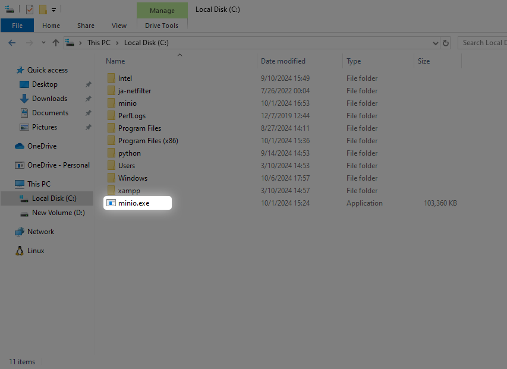
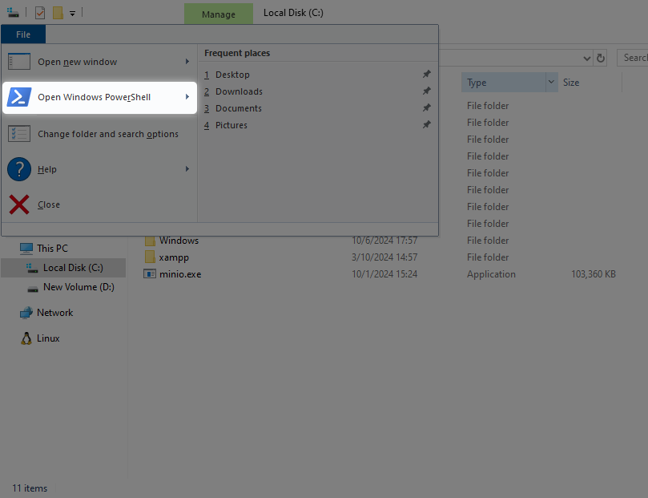
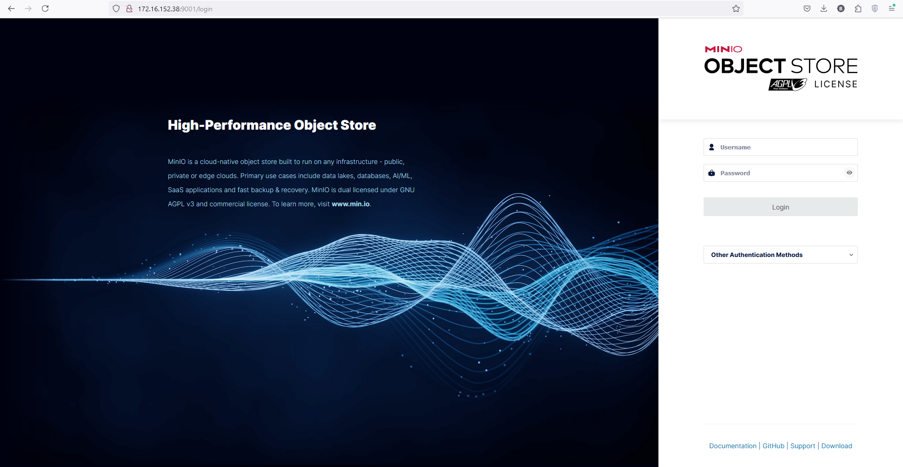

### **MinIO چیست؟**

Minio سیستم ذخیره‌سازی Object Storage متن‌بازی است که به زبان GO نوشته شده است. این سرویس با فضای ذخیره‌سازی ابری آمازون  S3 سازگاری دارد و قابلیت‌های زیادی در‌اختیارتان می‌گذارد. به‌عبارت‌دیگر، Minio Client جایگزینی پیشرفته برای دستورهای یونیکس مانند ls ،cat ،cp ،mirror و diff ارائه می‌دهد و از سیستم‌های ذخیره فایل و سرویس ذخیره‌سازی ابری سازگار با Amazon S3(1) (AWS Signature v2 و v4) نیز پشتیبانی می‌کند. با استفاده از Minio انواع فایل‌ها اعم از فیلم‌ها، فایل‌های گزارش، پشتیبان‌گیری و تصاویر را می‌توانید در درایو‌های متفاوتی که دراختیارتان قرار می‌دهد، ذخیره کنید. مین‌آی‌او Minioرا می‌توان به‌صورت Standalone روی یک سرور یا به‌صورت Distributed (کلاستر یا توزیع شده) روی چند سرور (حداکثر ۴ سرور) نصب کرد. از این سرویس برای ذخیره‌سازی‌های آبجکتی سیستم‌های دیگر مانند Azure Blob storage ،Google Cloud Platform ، Kubernetes  یا Docker به‌عنوان میکرو سرویس می‌توانید استفاده کنید.
{ .annotate }

1.  Amazon S3 یا (Simple Storage Service)، یک سرویس ذخیره‌سازی ابری محبوب است که توسط Amazon Web Services ارائه می‌شود.

??? info "داکر چیست؟"

    [جهت مشاهده اطلاعات بیشتر درخصوص داکر کلیک کنید](/page-docker)


??? info "کوبرنیتز چیست؟"

    [جهت مشاهده اطلاعات بیشتر درخصوص کوبرنیتز کلیک کنید](/page-kubernetes)


### **ویژگی‌های MinIO**

یکی از مهم‌ترین ویژگی‌های Minio ، قابلیت مقیاس‌پذیری افقی است. به این معنی که با استفاده از این سیستم، می‌توان متناسب با افزایش نیازهای ذخیره‌سازی خود، nodeهای ذخیره‌سازی بیشتری را به سرورهای خود اضافه کرد. این ویژگی، Minio را به یک راه‌حل با انعطاف‌پذیری بالا تبدیل می‌کند که می‌تواند با طیف گسترده‌ای از نیازهای محیط کاری منطبق شود و نیازهای مختلفی را حل کند.

از سوی دیگر، Minio با کارایی بالا، سرعت بسیار زیاد و توان عملیاتی بسیار بالا طراحی شده است. این سیستم، معماری توزیع‌شده دارد که اجازه ذخیره‌سازی داده را در بین چندین node می‌دهد و همین موضوع باعث می‌شود سرعت دسترسی و پایداری در برابر خطاهای سخت‌افزاری افزایش پیدا کند.

افزون بر این، ویژگی دیگر Minio ، سازگاری آن با طیف گسترده‌ای از معماری‌های Cloud Native، ازجمله Kubernetes، Docker و OpenShift، است. این ویژگی باعث می‌شود ترکیب جریان‌های کاری موجود و استقرار آن‌ها در انواع پلتفرم‌های مختلف، با سهولت بیشتری انجام شود.

بنابراین و به‌طور کلی می‌توان گفت که به‌طور کلی، MinIO یک سیستم ذخیره‌سازی اشیا منبع‌باز و قدرتمند است . این سیستم برای شرکت‌ها و توسعه‌دهندگان راهکار ذخیره‌سازی مقرون به صرفه، مقیاس‌پذیر با کارآمدی بالا برای دیتاهای بدون ساختار ارائه می‌کند و از این روی بسیار مورد توجه این سازمان‌ها قرار گرفته است.

### **مزایای MinIO**

 MinIO برای ذخیره‌سازی شیء چندین مزیت دارد. چند مورد از این مزایا عبارتند از:

**عملکرد بالا**

طراحی MinIO به گونه‌ایست که این سیستم می‌تواند داده‌های بدون‌ ساختار را با تاخیر بسیار کم و توان عملیاتی بالا ارائه کند. استفاده از یک معماری توزیع‌شده که داده‌های مختلف را در سرورهای متعدد تکرار می‌کند باعث می‌شود که خطر از دست دادن یا قطعی داده کاهش پیدا کند و از این رو مورد توجه مشتریان قرار گیرد.

**مقیاس‌پذیری بالا**

قابلیت مقیاس‌پذیری بالای MinIO می‌تواند برای پاسخگویی به نیازهای متغیر ذخیره‌سازی استفاده شود. این سیستم برای شرکت ها و توسعه‌دهندگانی که نیاز به ذخیره‌سازی انعطاف‌پذیر دارند ، راه‌حلی ایده‌آل و مطلوب است

**مقرون به‌صرفه**

 از آنجایی که MinIO متن‌باز است و بر روی سخت‌افزارهای عمومی قابل اجراست، یک راه‌حل مقرون به‌صرفه و کم‌هزینه برای ذخیره‌سازی به شمار می‌رود. طراحی ماژولار minIO به کاربران اجازه می‌دهد که از سطوح کوچک شروع کنند و به مرور زمان بزرگ و بزرگتر شوند. این مسئله هزینه‌های اولیه را کاهش می‌دهد  و بسیار مقرون به صرفه‌است.

### **Object Storage چیست؟‌**

Object Storageیا ذخیره‌سازی اشیا، یکی از روش‌های نگه‌داری و ذخیره‌ی داده‌های بدون ساختار است. این داده‌ها معمولا از جنس داده‌هایی هستند که یک بار تولید شده‌اند اما قرار است بارها مورد استفاده قرار گیرند. این داده‌ها می‌توانند در فرمت‌های مختلفی مانند فیلم‌، عکس‌، فایل‌های موسیقی و همچنین فایل‌هایی باشند که در ارتباطات آنلاین استفاده می‌شوند.

در Object Storage ، دیتاها به واحدهای (object) مختلفی تقسیم می‌شوند و فرایند ذخیره‌سازی در یک محیط مسطح و بدون ساختار انجام می‌شود. در این روش، هر object شامل موارد زیر است :

*   داده‌ها
*   متادیتا
*   شناسه منحصربه‌فرد

به‌صورت کلی می‌توان گفت که در Object Storage، اجزای مختلف یک داده با یکدیگر ترکیب می‌شوند و در نهایت به‌صورت یک object یا شئ درون یک استخر ذخیره‌سازی (storage pool) ذخیره می‌شوند.

 دسترسی به این داده‌ها نیز چندان سخت نیست. برای دسترسی لازم است از یک شناسه منحصر به فرد و متادیتا استفاده شود تا امکان دسترسی به object موردنظر به راحتی فراهم شود. داده‌ها می‌توانند با استفاده از APIهای RESTful، HTTP در دسترس قرار گیرند.

### **نصب و راه اندازی MinIO**

برای نصب مین آی او می توانید با توجه به شرایط از دستورات زیر استفاده نمایید.

#### **نصب در Mac OSX**

ترمینال را باز کنید و دستور زیر را برای نصب آخرین نسخه MinIO در سیستم عامل **MacOS** وارد کنید:

```css
brew install minio/stable/minio
```

نکته:

اگر قبلاً سرور MinIO را با استفاده از brew install minio نصب کرده‌اید، توصیه می‌کنیم به جای آن از minio/stable/minio دوباره نصب کنید.

```plaintext
brew uninstall minio
brew install minio/stable/minio
```

**راه اندازی سرور MinIO**

دستورات زیر را وارد ترمینال و اجرا کنید:

```plaintext
export MINIO_CONFIG_ENV_FILE=/etc/default/minio
minio server --console-address :9001
```

در صورت اجرای مین‌آی‌او نتیجه‌ی زیر قابل مشاهده خواهد بود: 

```plaintext
Status:         1 Online, 0 Offline.
API: http://192.168.2.100:9000 http://127.0.0.1:9000
RootUser: myminioadmin
RootPass: minio-secret-key-change-me
Console: http://192.168.2.100:9001 http://127.0.0.1:9001
RootUser: myminioadmin
RootPass: minio-secret-key-change-me

Command-line: https://min.io/docs/minio/linux/reference/minio-mc.html
   $ mc alias set myminio http://10.0.2.100:9000 myminioadmin minio-secret-key-change-me

Documentation: https://min.io/docs/minio/linux/index.html
```

جهت مشاهده مین‌آی‌او در مرورگر به آدرس زیر مراجعه کنید: 

https://127.0.0.1:9000

#### **نصب در Linux**

ترمینال را باز کنید و دستور زیر را برای نصب آخرین نسخه MinIO در سیستم عامل **MacOS** وارد کنید:

نصب در پردازنده های amd64 (Intel or AMD 64-bit processors)

```plaintext
wget https://dl.min.io/server/minio/release/linux-amd64/archive/minio-20241002175041.0.0-1.x86_64.rpm -O minio.rpm
sudo dnf install minio.rpm
```

نصب در پردازنده های arm64 (Apple M1/M2 or other ARM 64-bit processors)

```plaintext
wget https://dl.min.io/server/minio/release/linux-arm64/archive/minio-20241002175041.0.0-1.aarch64.rpm -O minio.rpm
sudo dnf install minio.rpm
```

**راه اندازی سرور MinIO**

دستورات زیر را وارد ترمینال و اجرا کنید:

```plaintext
mkdir ~/minio
minio server ~/minio --console-address :9001
```

در صورت اجرای مین‌آی‌او نتیجه‌ی زیر قابل مشاهده خواهد بود: 

```plaintext
API: http://192.0.2.10:9000  http://127.0.0.1:9000
RootUser: minioadmin
RootPass: minioadmin

Console: http://192.0.2.10:9001 http://127.0.0.1:9001
RootUser: minioadmin
RootPass: minioadmin

Command-line: https://min.io/docs/minio/linux/reference/minio-mc.html
   $ mc alias set myminio http://192.0.2.10:9000 minioadmin minioadmin

Documentation: https://min.io/docs/minio/linux/index.html

WARNING: Detected default credentials 'minioadmin:minioadmin', we recommend that you change these values with 'MINIO_ROOT_USER' and 'MINIO_ROOT_PASSWORD' environment variables.
```

جهت مشاهده مین‌آی‌او در مرورگر به آدرس زیر مراجعه کنید: 

[https://127.0.0.1:9000](https://127.0.0.1:9000)

++++++

#### **نصب در Windows**

ابتدا فایل زیر را دانلود نمایید:

دانلود فایل


[ <i class="fa fa-download" ></i> دانلود فایل
](https://dl.min.io/server/minio/release/windows-amd64/minio.exe){ .md-button }


فایل دانلود شده را جهت سهولت در اجرا به درایو C منتقل کرده و ترمینال PowerShell را اجرا کنید.






**راه اندازی سرور MinIO**

دستورات زیر را وارد ترمینال PowerShell کرده و اجرا کنید:

```plaintext
\minio.exe server C:\minio --console-address :9001
```

در صورت اجرای مین‌آی‌او نتیجه‌ی زیر قابل مشاهده خواهد بود: 

```plaintext
MinIO Object Storage Server
Copyright: 2015-2024 MinIO, Inc.
License: GNU AGPLv3 - https://www.gnu.org/licenses/agpl-3.0.html
Version: RELEASE.2024-09-22T00-33-43Z (go1.22.7 windows/amd64)

API: http://172.16.152.38:9000 http://127.0.0.1:9000
   RootUser: minioadmin
   RootPass: minioadmin

WebUI: http://172.16.152.38:9001 http://127.0.0.1:9001
   RootUser: minioadmin
   RootPass: minioadmin

CLI: https://min.io/docs/minio/linux/reference/minio-mc.html#quickstart
   $ mc alias set 'myminio' 'http://172.16.152.38:9000' 'minioadmin' 'minioadmin'

Docs: https://docs.min.io
WARN: Detected default credentials 'minioadmin:minioadmin', we recommend that you change these values with 'MINIO_ROOT_USER' and 'MINIO_ROOT_PASSWORD' environment variables
```

جهت مشاهده مین‌آی‌او در مرورگر به آدرس زیر مراجعه کنید: 

https://127.0.0.1:9000




منابع:

hamravesh.com

[https://en.wikipedia.org/wiki/Amazon_S3](https://en.wikipedia.org/wiki/Amazon_S3)

[https://aws.amazon.com/](https://aws.amazon.com/)