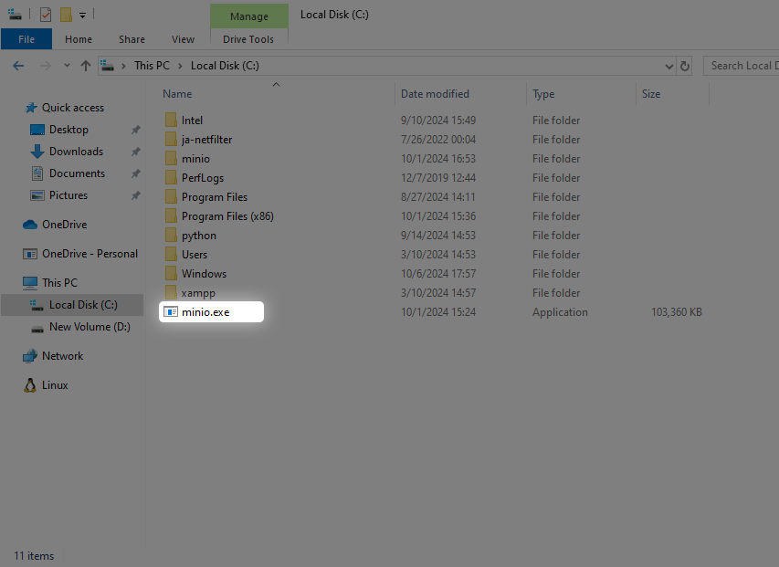
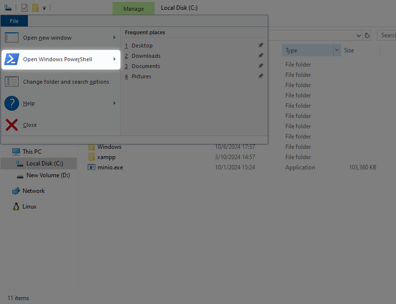
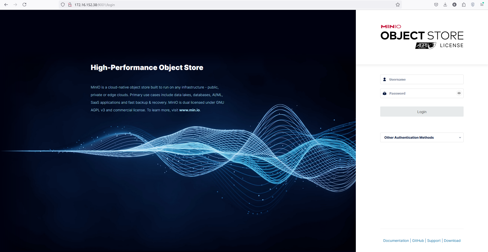
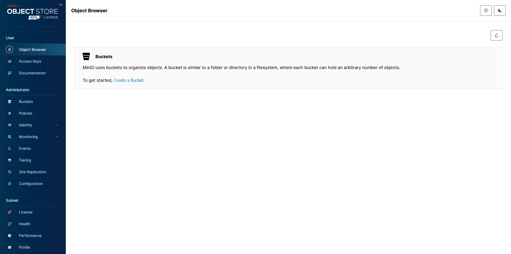
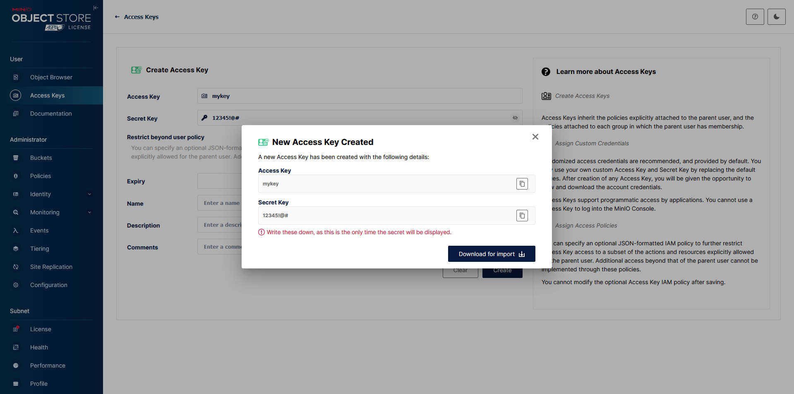
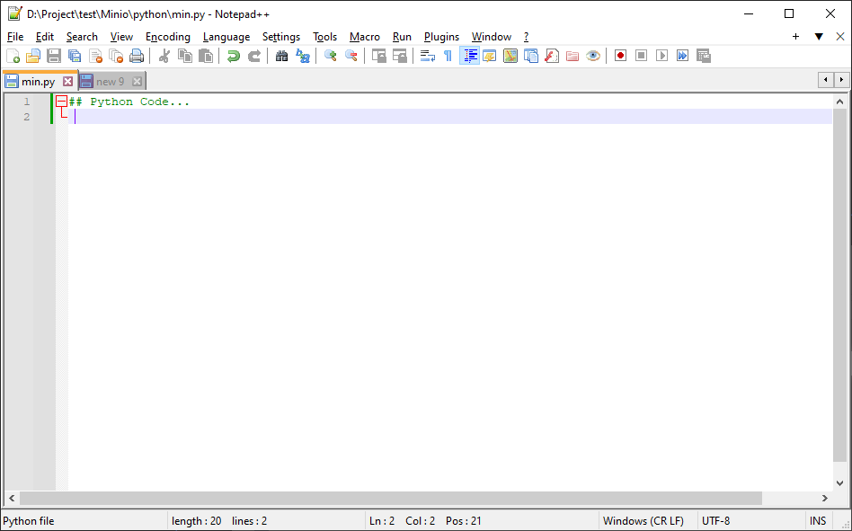
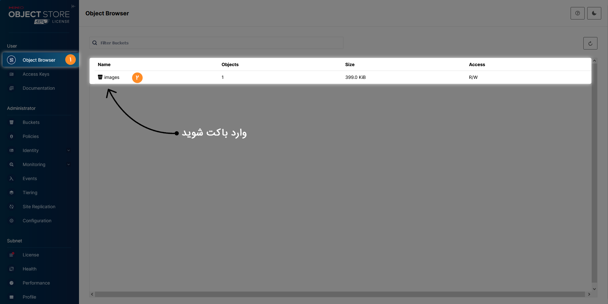
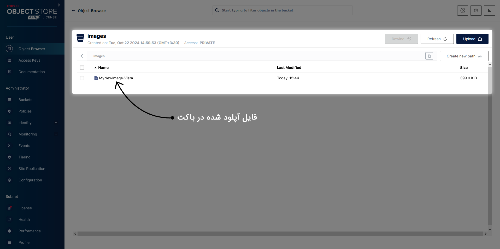

### **MinIO چیست؟**

Minio سیستم ذخیره‌سازی Object Storage متن‌بازی است که به زبان GO نوشته شده است. این سرویس با فضای ذخیره‌سازی ابری آمازون  S3 سازگاری دارد و قابلیت‌های زیادی در‌اختیارتان می‌گذارد. به‌عبارت‌دیگر، Minio Client جایگزینی پیشرفته برای دستورهای یونیکس مانند ls ،cat ،cp ،mirror و diff ارائه می‌دهد و از سیستم‌های ذخیره فایل و سرویس ذخیره‌سازی ابری سازگار با Amazon S3(1) (AWS Signature v2 و v4) نیز پشتیبانی می‌کند. با استفاده از Minio انواع فایل‌ها اعم از فیلم‌ها، فایل‌های گزارش، پشتیبان‌گیری و تصاویر را می‌توانید در درایو‌های متفاوتی که دراختیارتان قرار می‌دهد، ذخیره کنید. مین‌آی‌او Minioرا می‌توان به‌صورت Standalone روی یک سرور یا به‌صورت Distributed (کلاستر یا توزیع شده) روی چند سرور (حداکثر ۴ سرور) نصب کرد. از این سرویس برای ذخیره‌سازی‌های آبجکتی سیستم‌های دیگر مانند Azure Blob storage ،Google Cloud Platform ، Kubernetes  یا Docker به‌عنوان میکرو سرویس می‌توانید استفاده کنید.
{ .annotate }

1.  Amazon S3 یا (Simple Storage Service)، یک سرویس ذخیره‌سازی ابری محبوب است که توسط Amazon Web Services ارائه می‌شود.

??? info "داکر چیست؟"

    [جهت مشاهده اطلاعات بیشتر درخصوص داکر کلیک کنید](/page-docker)


??? info "کوبرنیتز چیست؟"

    [جهت مشاهده اطلاعات بیشتر درخصوص کوبرنیتز کلیک کنید](/page-kubernetes)


### **ویژگی‌های MinIO**

یکی از مهم‌ترین ویژگی‌های Minio ، قابلیت مقیاس‌پذیری افقی است. به این معنی که با استفاده از این سیستم، می‌توان متناسب با افزایش نیازهای ذخیره‌سازی خود،  nodeهای ذخیره‌سازی بیشتری را به سرورهای خود اضافه کرد. این ویژگی،  Minioرا به یک راه‌حل با انعطاف‌پذیری بالا تبدیل می‌کند که می‌تواند با طیف گسترده‌ای از نیازهای محیط کاری منطبق شود و نیازهای مختلفی را حل کند.

از سوی دیگر، Minio با کارایی بالا، سرعت بسیار زیاد و توان عملیاتی بسیار بالا طراحی شده است. این سیستم، معماری توزیع‌شده دارد که اجازه ذخیره‌سازی داده را در بین چندین node می‌دهد و همین موضوع باعث می‌شود سرعت دسترسی و پایداری در برابر خطاهای سخت‌افزاری افزایش پیدا کند.

افزون بر این، ویژگی دیگر Minio ، سازگاری آن با طیف گسترده‌ای از معماری‌های Cloud Native، ازجمله Kubernetes، Docker و OpenShift، است. این ویژگی باعث می‌شود ترکیب جریان‌های کاری موجود و استقرار آن‌ها در انواع پلتفرم‌های مختلف، با سهولت بیشتری انجام شود.

بنابراین و به‌طور کلی می‌توان گفت که به‌طور کلی، MinIO یک سیستم ذخیره‌سازی اشیا منبع‌باز و قدرتمند است. این سیستم برای شرکت‌ها و توسعه‌دهندگان راهکار ذخیره‌سازی مقرون به صرفه، مقیاس‌پذیر با کارآمدی بالا برای دیتاهای بدون ساختار ارائه می‌کند و از این روی بسیار مورد توجه این سازمان‌ها قرار گرفته است.

### **مزایای MinIO**

 MinIO برای ذخیره‌سازی شیء چندین مزیت دارد. چند مورد از این مزایا عبارتند از:

<span class="right-color-1">
**عملکرد بالا**
طراحی MinIO به گونه‌ایست که این سیستم می‌تواند داده‌های بدون‌ ساختار را با تاخیر بسیار کم و توان عملیاتی بالا ارائه کند. استفاده از یک معماری توزیع‌شده که داده‌های مختلف را در سرورهای متعدد تکرار می‌کند باعث می‌شود که خطر از دست دادن یا قطعی داده کاهش پیدا کند و از این رو مورد توجه مشتریان قرار گیرد.
</span>

<span class="right-color-1">
**مقیاس‌پذیری بالا**
قابلیت مقیاس‌پذیری بالای MinIO می‌تواند برای پاسخگویی به نیازهای متغیر ذخیره‌سازی استفاده شود. این سیستم برای شرکت ها و توسعه‌دهندگانی که نیاز به ذخیره‌سازی انعطاف‌پذیر دارند ، راه‌حلی ایده‌آل و مطلوب است
</span>

<span class="right-color-1">
**مقرون به‌صرفه**
از آنجایی که MinIO متن‌باز است و بر روی سخت‌افزارهای عمومی قابل اجراست، یک راه‌حل مقرون به‌صرفه و کم‌هزینه برای ذخیره‌سازی به شمار می‌رود. طراحی ماژولار minIO به کاربران اجازه می‌دهد که از سطوح کوچک شروع کنند و به مرور زمان بزرگ و بزرگتر شوند. این مسئله هزینه‌های اولیه را کاهش می‌دهد  و بسیار مقرون به صرفه‌است.
</span>

### **Object Storage چیست؟‌**

Object Storageیا ذخیره‌سازی اشیا، یکی از روش‌های نگه‌داری و ذخیره‌ی داده‌های بدون ساختار است. این داده‌ها معمولا از جنس داده‌هایی هستند که یک بار تولید شده‌اند اما قرار است بارها مورد استفاده قرار گیرند. این داده‌ها می‌توانند در فرمت‌های مختلفی مانند فیلم‌، عکس‌، فایل‌های موسیقی و همچنین فایل‌هایی باشند که در ارتباطات آنلاین استفاده می‌شوند.

در Object Storage ، دیتاها به واحدهای (object) مختلفی تقسیم می‌شوند و فرایند ذخیره‌سازی در یک محیط مسطح و بدون ساختار انجام می‌شود. در این روش، هر object شامل موارد زیر است :

*   داده‌ها
*   متادیتا
*   شناسه منحصربه‌فرد

به‌صورت کلی می‌توان گفت که در Object Storage، اجزای مختلف یک داده با یکدیگر ترکیب می‌شوند و در نهایت به‌صورت یک object یا شئ درون یک استخر ذخیره‌سازی (storage pool) ذخیره می‌شوند.

 دسترسی به این داده‌ها نیز چندان سخت نیست. برای دسترسی لازم است از یک شناسه منحصر به فرد و متادیتا استفاده شود تا امکان دسترسی به object موردنظر به راحتی فراهم شود. داده‌ها می‌توانند با استفاده از APIهای RESTful، HTTP در دسترس قرار گیرند.

### **نصب و راه اندازی MinIO**

برای نصب مین آی او می توانید با توجه به شرایط از دستورات زیر استفاده نمایید.

#### **نصب در Mac OSX**

ترمینال را باز کنید و دستور زیر را برای نصب آخرین نسخه MinIO در سیستم عامل **MacOS** وارد کنید:

```sh
brew install minio/stable/minio
```

نکته:

اگر قبلاً سرور MinIO را با استفاده از brew install minio نصب کرده‌اید، توصیه می‌کنیم به جای آن از minio/stable/minio دوباره نصب کنید.

```sh
brew uninstall minio
brew install minio/stable/minio
```

**راه اندازی سرور MinIO**

دستورات زیر را وارد ترمینال و اجرا کنید:

```sh
export MINIO_CONFIG_ENV_FILE=/etc/default/minio
minio server --console-address :9001
```

در صورت اجرای مین‌آی‌او نتیجه‌ی زیر قابل مشاهده خواهد بود: 

```console
Status:         1 Online, 0 Offline.
API: http://192.168.2.100:9000 http://127.0.0.1:9000
RootUser: myminioadmin
RootPass: minio-secret-key-change-me
Console: http://192.168.2.100:9001 http://127.0.0.1:9001
RootUser: myminioadmin
RootPass: minio-secret-key-change-me

Command-line: https://min.io/docs/minio/linux/reference/minio-mc.html
   $ mc alias set myminio http://10.0.2.100:9000 myminioadmin minio-secret-key-change-me

Documentation: https://min.io/docs/minio/linux/index.html
```

جهت مشاهده مین‌آی‌او در مرورگر به آدرس زیر مراجعه کنید: 

https://127.0.0.1:9000

#### **نصب در Linux**

ترمینال را باز کنید و دستور زیر را برای نصب آخرین نسخه MinIO در سیستم عامل **MacOS** وارد کنید:

نصب در پردازنده های amd64 (Intel or AMD 64-bit processors)

```sh
wget https://dl.min.io/server/minio/release/linux-amd64/archive/minio-20241002175041.0.0-1.x86_64.rpm -O minio.rpm
sudo dnf install minio.rpm
```

نصب در پردازنده های arm64 (Apple M1/M2 or other ARM 64-bit processors)

```sh
wget https://dl.min.io/server/minio/release/linux-arm64/archive/minio-20241002175041.0.0-1.aarch64.rpm -O minio.rpm
sudo dnf install minio.rpm
```

**راه اندازی سرور MinIO**

دستورات زیر را وارد ترمینال و اجرا کنید:

```sh
mkdir ~/minio
minio server ~/minio --console-address :9001
```

در صورت اجرای مین‌آی‌او نتیجه‌ی زیر قابل مشاهده خواهد بود: 

```console
API: http://192.0.2.10:9000  http://127.0.0.1:9000
RootUser: minioadmin
RootPass: minioadmin

Console: http://192.0.2.10:9001 http://127.0.0.1:9001
RootUser: minioadmin
RootPass: minioadmin

Command-line: https://min.io/docs/minio/linux/reference/minio-mc.html
   $ mc alias set myminio http://192.0.2.10:9000 minioadmin minioadmin

Documentation: https://min.io/docs/minio/linux/index.html

WARNING: Detected default credentials 'minioadmin:minioadmin', we recommend that you change these values with 'MINIO_ROOT_USER' and 'MINIO_ROOT_PASSWORD' environment variables.
```

جهت مشاهده مین‌آی‌او در مرورگر به آدرس زیر مراجعه کنید: 

[https://127.0.0.1:9000](https://127.0.0.1:9000)

++++++

#### **نصب در Windows**

ابتدا فایل زیر را دانلود نمایید:

دانلود فایل


[ <i class="fa fa-download" ></i> دانلود فایل
](https://dl.min.io/server/minio/release/windows-amd64/minio.exe){ .md-button }


فایل دانلود شده را جهت سهولت در اجرا به درایو C منتقل کرده و ترمینال PowerShell را اجرا کنید.






**راه اندازی سرور MinIO**

دستورات زیر را وارد ترمینال PowerShell کرده و اجرا کنید:

```sh
\minio.exe server C:\minio --console-address :9001
```

در صورت اجرای مین‌آی‌او نتیجه‌ی زیر قابل مشاهده خواهد بود: 

```console
MinIO Object Storage Server
Copyright: 2015-2024 MinIO, Inc.
License: GNU AGPLv3 - https://www.gnu.org/licenses/agpl-3.0.html
Version: RELEASE.2024-09-22T00-33-43Z (go1.22.7 windows/amd64)

API: http://172.16.152.38:9000 http://127.0.0.1:9000
   RootUser: minioadmin
   RootPass: minioadmin

WebUI: http://172.16.152.38:9001 http://127.0.0.1:9001
   RootUser: minioadmin
   RootPass: minioadmin

CLI: https://min.io/docs/minio/linux/reference/minio-mc.html#quickstart
   $ mc alias set 'myminio' 'http://172.16.152.38:9000' 'minioadmin' 'minioadmin'

Docs: https://docs.min.io
WARN: Detected default credentials 'minioadmin:minioadmin', we recommend that you change these values with 'MINIO_ROOT_USER' and 'MINIO_ROOT_PASSWORD' environment variables
```

جهت مشاهده مین‌آی‌او در مرورگر به آدرس زیر مراجعه کنید: 

https://127.0.0.1:9000





جهت وارد شدن به محیط مدیریت مین آی او می بایست از نام کاربری و رمز عبور پیشفرض استفاده کنید:

**نام کاربری:** minioadmin

**رمزعبور:** minioadmin

بعداز وارد شدن (لاگین کردن) محیط کاربری مین آی او را مشاهده خواهید کرد.



در قدم اول می بایست برای نگهداری آبجکت ها(فایل ها) یک باکت (سطل) جدیدی ایجاد نمود، MinIO از سطل ها (باکت ها)  برای سازماندهی اشیاء (باکت ها) استفاده می کند. یک سطل شبیه به یک پوشه یا دایرکتوری در یک سیستم فایل است که در هر سطل می تواند تعداد دلخواه فایل را در خود جای دهد.

### **نمونه پروژه پایتونی**

برای ایجاد باکت جدید بصورت دستی می توانید مراحل زیر را دنبال کنید:


۱ - Bucket Name : عنوان باکت جدید

۲ – قوانین نام گذاری باکت جدید

*   نام باکت باید بین ۳ (دقیقه) تا ۶۳ (حداکثر) کاراکتر باشد.
*   نام باکت فقط می تواند از حروف کوچک، اعداد، نقطه (.) و خط فاصله (-) تشکیل شود.
*   نام باکت نباید دارای دو نقطه مجاور یا نقطه مجاور یک خط فاصله باشد.
*   نام باکت نباید به عنوان یک آدرس IP قالب بندی شود (به عنوان مثال، 192.168.5.4)
*   نام باکت نباید با پیشوند xn-- شروع شود.
*   نام باکت نباید با پسوند -s3alias ختم شود. این پسوند برای نام مستعار نقاط دسترسی محفوظ است.
*   نام باکت باید در یک پارتیشن منحصر به فرد باشد.

۳ – ویژگی ها

*   Versioning یا نسخه سازی : MinIO از نگهداری چندین نسخه از یک شی در یک باکت (سطل) پشتیبانی می کند.
*   Object Locking یا قفل کردن شی : زمانی که برای اولین بار یک باکت  ایجاد می کنید، می توانید Object Locking را فعال کنید.اگر این گزینه فعال باشد، گزینه های Exclude folders و prefixes در دسترس نخواهد بود.
*   Quota یا سهمیه (محدودیت) : تعیین سقف مجاز برای وارد کردن فایل ها در باکت. 

در فیلد نام باکت (Bucket Name) یک نام دلخواه بر اساس قوانین نام گذاری بالا وارد کرده و روی Create Bucket کلیک کنید.


باکت جدید با نام Images ایجاد گردید.


ایجاد کلید دسترسی

بوسیله ی کلید دسترسی می توان عملیات های مرتبط با مین آی او را انجام داد، مواردی از قبیل : ایجاد باکت، حذف و...

۱ – از طریق پیشخوان وارد بخش Access Keys شوید.

۲ – بر روی دکمه Create access key کلیک کنید.


پس از وارد شدن به صفحه ایجاد کلید دسترسی جدید با صفحه ذیل مواجه خواهید شد.

نکته: نام کلید و رمز کلید بصورت پیشفرض در فیلد های مربوطه وارد خواهند شد که می‌توانید آنها را تغییر دهید.


۱ – فیلد Access Key : عنوان کلید ( قابل تغییر ) 

۲ – فیلد Secret Key : رمز کلید ( قابل تغییر )

۳ – فیلد Restrict beyond user policy : محدود کردن سیاست های دسترسی کاربر ( با فعال سازی این قابلیت تنظیمات را در قالب JSON باید وارد کنید.

۴ – فیلد Expiry : تعیین تاریخ انقضاء کلید دسترسی

۵ – فیلد Name : نام دلخواه

۶ – فیلد Description : توضیحات

۷ – فیلد Comments : نظرات (دلخواه)

نکته: رمز کلید ساخته شده پس از ایجاد کلید قابل مشاهده نیست، بهتر است رمز کلید را ذخیره کنید.

نتیجه‌ی ایجاد کلید با نام دلخواه در تصویر ذیل :




### **پروژه برنامه نویسی**

پس از ایجاد کلید دسترسی می توان از طریق زبان های برنامه نویسی پشتیبان شده به مین‌آی‌او متصل گردید، در این مثال از زبان برنامه نویسی پایتون استفاده خواهد شد.

پیش نیاز ها:

1.  ابتدا آخرین نسخه ی پایتون را در سیستم خود نصب کنید.
2.  ایجاد فایل با نام دلخواه و پسوند py


فایل مربوطه را از طریق یکی از برنامه های IDE باز کنید، در این مثال از برنامه (Notepad++) استفاده شده است.



کد های زیر را در فایل ایجاد شده قرار داده و مقادیر لازم را جایگزین و ذخیره کنید:

```python
## Python Code...

## وارد کردن گتابخانه مین آی او
from minio import Minio 

## ایجاد کلاینت اتصال بوسیله اطلاعات ایجاد شده
client = Minio("127.0.0.1:9000", "mykey", "12345!@#", secure=False)

## ایجاد متغیر نام باکت
bucket_name = "images"

## مسیر فایل جهت بارگزاری (نکته: برای مسیر دهی فایل در ساختار سیستم ویندوزی می بایست از ۲ بک اسلش استفاده کرد.)
image_path = "D:\\images\\vista.jpg"

## تغغیر نام فایل به نام دلخواه
object_name = "MyNewImage-Vista"

## ارسال اطلاعات و ذخیره فایل(آبجکت) در باکت
client.fput_object(
    bucket_name=bucket_name,
    object_name=object_name,
    file_path=image_path,
    content_type="image/jpeg"
)
```

برای مشاهده نتیجه عملیات بارگزاری فایل به داشبورد مدیریت مراجعه کنید، از بخش **Object Browser** وارد باکت ایجاد شده شوید.



پس از وارد شدن به باکت فایل بارگزاری شده قابل مشاهده است.




منابع:

hamravesh.com

[https://en.wikipedia.org/wiki/Amazon_S3](https://en.wikipedia.org/wiki/Amazon_S3)

[https://aws.amazon.com/](https://aws.amazon.com/)