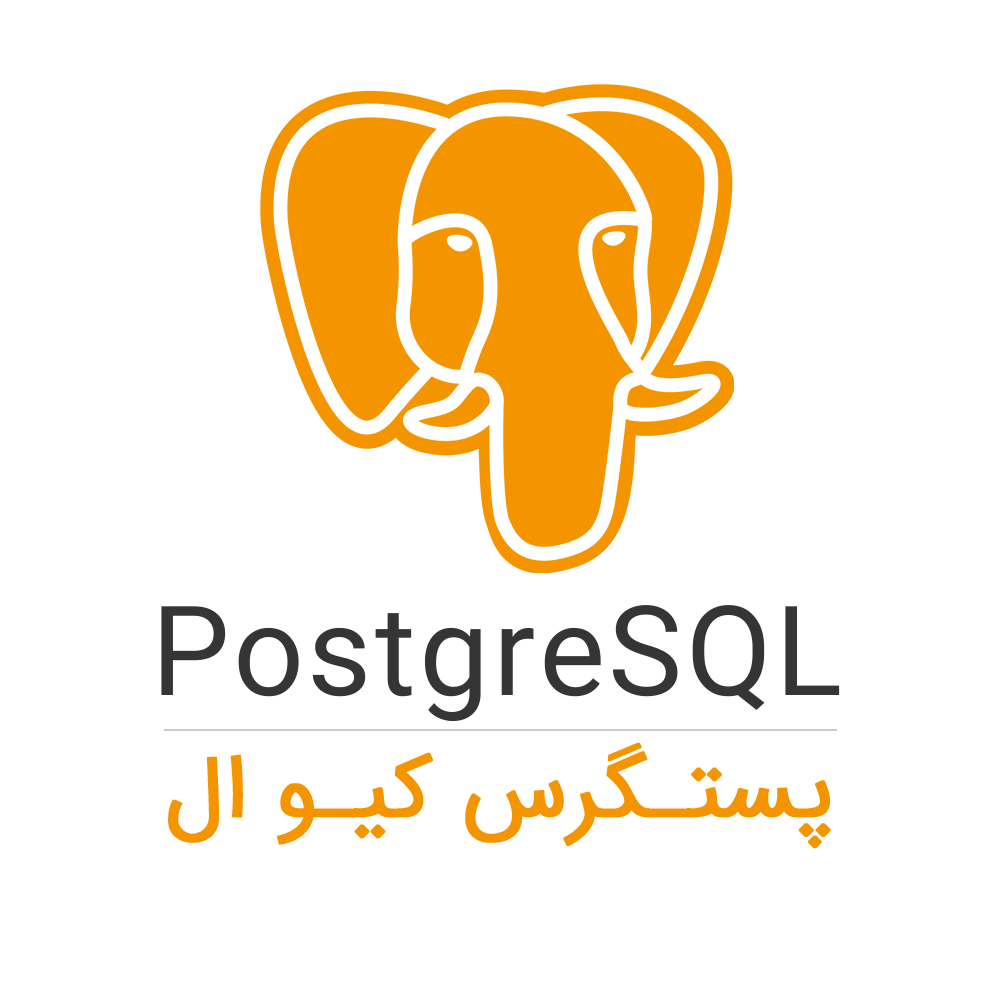
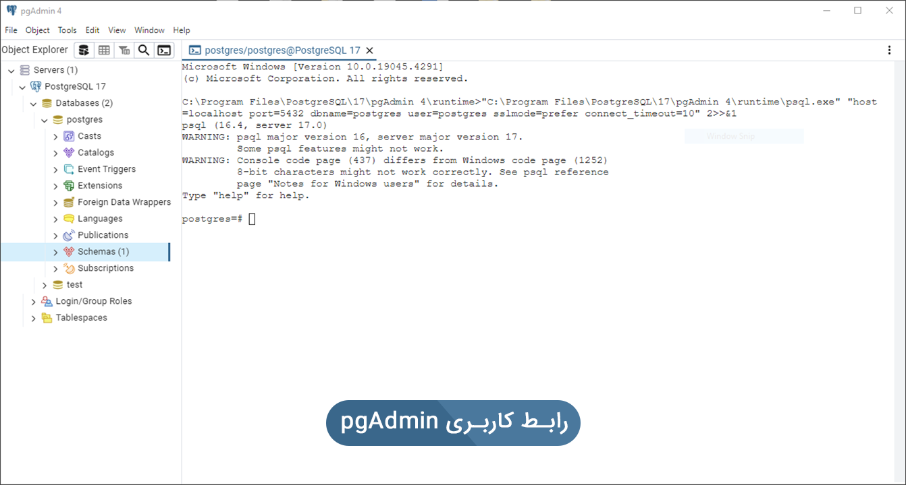
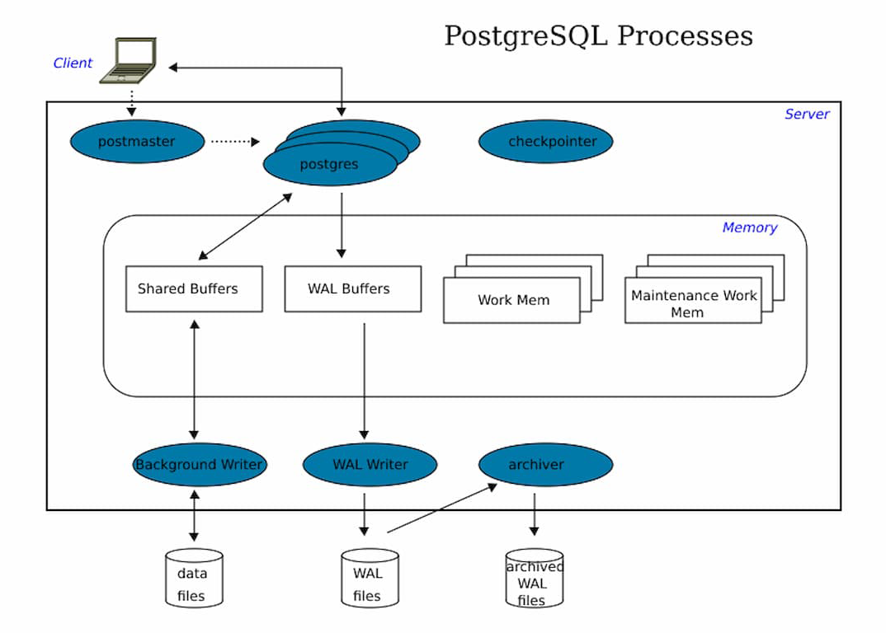

### **معرفی پستگرس‌**

پستگرس‌ (PostgreSQL) یک سیستم مدیریت پایگاه داده رابطه ای رایگان و اوپن سورس (RDBMS) است که بر توسعه پذیری و انطباق استانداردهای فنی تأکید دارد. این سیستم برای رسیدگی به طیف وسیعی از بارهای کاری، از دستگاه های تک کاربره گرفته تا انبارهای داده یا وب سرویس ها با کاربران همزمان زیاد طراحی شده است. PostgreSQL، همچنین به عنوان Postgres شناخته می شود، به هیچ شرکتی یا سایر نهادهای خصوصی تعلق ندارد و تحت کنترل آنها نیست و دسترسی به سورس آن رایگان است. طراحی پستگرس‌ کیوال براساس POSTGRES 4.2 در بخش علوم کامپیوتر دانشگاه برکلی کالیفرنیا تکمیل شده است. این پایگاه داده پیش فرض برای macOS Server است و بر روی سیستم عامل های متعددی شامل لینوکس، اکثر برنامه های کاربردی یونیکس، ویندوز، MacOS X ،Solaris ،Tru64T ،FreeBSD ،OpenBSD اجرا می شود.  
پستگرس‌ از متن، تصاویر، صدا و ویدئو پشتیبانی می کند و شامل رابط های برنامه نویسی برای سی و سی پلاس پلاس، جاوا، پرل، پایتون ، روبی، Tcl و ODBC است.   
PostgreSQL اولین سیستم مدیریت پایگاه داده است که چندین نسخه کنترل همزمان (MVCC)(1) را حتی قبل از اوراکل اجرا می کند. PostgreSQL طراحی شده است تا قابل گسترش باشد. در PostgreSQL شما می توانید نوع داده های خود، انواع شاخص ها، زبان های عملکردی و غیره را تعریف کنید.  
{ .annotate }

1.  Multi-Version Concurrency Control (MVCC) تکنیکی است که توسط PostgreSQL استفاده می‌شود تا به چندین تراکنش اجازه می‌دهد تا به داده‌های مشابه بدون درگیری یا تاخیر دسترسی داشته باشند.

**معرفی Pgadmin**

PgAdmin یک برنامه رابط کاربری رایگان با اوپن سورس PostgreSQL برای سیستم عامل Microsoft Windows،Mac OS X و Linux است. این برنامه بازیابی اطلاعات سرور بانک اطلاعاتی، توسعه، تست و نگهداری مداوم را ارائه می دهد. pgAdmin یک پروژه جامعه ای است که از تعدادی داوطلب از سراسر جهان تشکیل شده است. pgadmin ابزاری با هدف کلی برای طراحی، نگهداری و اجرای بانک های اطلاعاتی Postgres است.  



**امکانات پستگرس:**

●    ورود SQL دلخواه  
●    مرورگرهای اطلاعات برای پایگاه داده ها، جداول، فهرست ها، توالی ها، نمایش ها، محرک ها، عملکردها و زبان ها  
●    دیالوگ های پیکربندی کاربر، گروه و Privilege  
●    ردیابی نسخه با تولید نسخه بروزرسانی اسکریپت  
●    تنظیمات جدول مایکروسافت MSysConf  
●    ویزارد ایمپورت و اکسپورت داده ها  
●    ویزارد Migration پایگاه داده  
●    گزارش های از پیش تعریف شده در پایگاه داده ها، جداول، ایندکس ها، توالی ها، زبان ها و ویوو ها

**ویژگی های پستگرس‌**

PostgreSQL دارای بسیاری از ویژگی های پیشرفته است که سایر سیستم های مدیریت پایگاه داده سازمانی ارائه می دهند، مانند:  
●    تایپ تعریف شده توسط کاربر  
●    وراثت جدول  
●    مکانیسم قفل پیشرفته  
●    تمامیت ارجاعی کلید خارجی  
●    دیدگاه ها، قوانین، اشیا فرعی  
●    معاملات تودرتو (پس انداز)  
●    کنترل همزمان چند نسخه (MVCC)  
●    تکثیر ناهمزمان

**امنیت در پستگرس‌** 

PostgreSQL امنیت داخلی خود را بر اساس هر نقش مدیریت می کند. به طور کلی یک نقش به عنوان یک کاربر (نقشی که می تواند وارد سیستم شود) یا یک گروه (نقشی است که سایر نقش ها عضو هستند) در نظر گرفته می شود. مجوزها را می توان در هر موردی به سطح ستون اعطا یا ابطال کرد، همچنین می تواند از ایجاد اشیاء جدید در سطح دیتابیس، شماتیک یا جدول مجوز جلوگیری کند.  
ویژگی SECURITY LABEL PostgreSQL (گسترش به استانداردهای SQL)، امنیت بیشتری را فراهم می آورد. با یک ماژول قابل دانلود همراه است که از کنترل دسترسی اجباری مبتنی بر برچسب (MAC) مبتنی بر سیاست امنیتی Security Enhanced Linux (SELinux) پشتیبانی می کند.

**معماری پستگرس‌**



### **نصب پستگرس**

#### نصب در **Windows**

فایل زیر را دانلود و نصب نمایید.

دانلود فایل

#### **نصب در Mac OS X**

*   نرم‌افزار  Postgres.appرا دانلود و مانند سایر اپلیکیشن‌ها بر روی سیستم عامل خود نصب کنید.
*   نرم‌افزار را دانلود کنید فایل آن را در پوشه Applications قراردهید و اجرا کنید.


#### **نصب در** Ubuntu

**به‌روزرسانی بسته‌ها**: ابتدا، سیستم خود را با استفاده از دستور زیر به‌روزرسانی کنید**:**

```sh
sudo apt update
sudo apt upgrade
```

**نصب PostgreSQL:** برای نصب PostgreSQL، از دستور زیر استفاده کنید:

```sh
sudo apt install postgresql postgresql-contrib
```

**بررسی وضعیت PostgreSQL:** پس از نصب، می‌توانید وضعیت سرویس PostgreSQL را با دستور زیر بررسی کنید:

```sh
sudo systemctl status postgresql
```

اگر سرویس در حال اجرا باشد، پیغام "Active Running…" را مشاهده خواهید کرد.

**ورود به محیط PostgreSQL:** برای ورود به محیط PostgreSQL، از کاربر postgres استفاده کنید:

```sh
sudo -i -u postgres
```

سپس برای ورود به محیط PostgreSQL از دستور زیر استفاده کنید:

```sh
psql
```

**ایجاد یک پایگاه داده جدید:** 

```sql
CREATE DATABASE mydatabase;
```

**خروج از محیط PostgreSQL:** برای خروج از محیط PostgreSQL، از دستور زیر استفاده کنید:

```sql
\q
```

**ساخت یک کاربر جدید**

برای ایجاد یک کاربر جدید، از دستور زیر استفاده کنید:

```sql
CREATE USER myuser WITH PASSWORD 'mypassword';
```

**اعطای دسترسی به کاربر**

برای اعطای دسترسی به کاربر جدید به پایگاه داده، از دستور زیر استفاده کنید:

```sql
GRANT ALL PRIVILEGES ON DATABASE mydatabase TO myuser;
```

**نکات اضافی**

    اگر می‌خواهید که کاربر جدید بتواند جداول و دیگر اشیاء را نیز ایجاد کند، می‌توانید از دستور زیر برای اعطای دسترسی اضافی استفاده کنید:

```sql
ALTER USER myuser CREATEDB;
```

#### **نصب در Fedora**

برای نصب پستگرس در فدورا از دستور زیر استفاده کنید:

```sql
sudo yum install postgresql93-server
```

### **پروژه برنامه نویسی**

پس از ایجاد کلید دسترسی می توان از طریق زبان های برنامه نویسی پشتیبان شده به مین‌آی‌او متصل گردید، در این مثال از زبان برنامه نویسی پایتون استفاده خواهد شد.

پیش نیاز ها:

1.  ابتدا آخرین نسخه ی پایتون را در سیستم خود نصب کنید.
2.  ایجاد فایل با نام دلخواه و پسوند py

#### نصب پکیج پایتونی psycopg2

برای نصب پکیج مربوطه در ترمینال یا CMD دستور زیر را وارد کنید و منتظر نصب پکیج باشید.

```sh
pip install psycopg2
```


