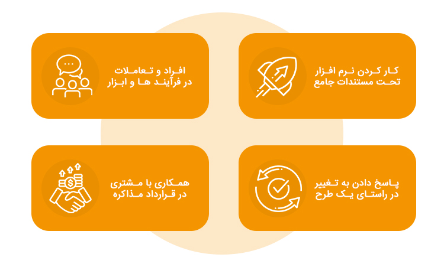

### **روش چابک یا اجایل (Agile) چیست؟**

تفکر چابک یا Agile ، مجموعه‌ای از اصول و ارزش‌ها است که استفاده از آن‌ها در محیط توسعه محصولات نرم افزاری، به نتایجی مانند محصولات مفید و کارآمد، مشتریان راضی و نیروی کار با انگیزه می‌انجامد. در واقع استفاده از این متدولوژی باعث می‌شود تولید نرم افزارها کاملا مطابق با نیاز مشتریان انجام شود. چرا که طبق این دیدگاه، مشتری از مهم‌ترین افراد در تولید پروژه بوده و تنها کسی است که از نیازهای واقعی نرم افزار مطلع است. خوب است بدانید، در روش چابک محصولات به صورت فازبندی به مشتری تحویل داده می‌شود و مشتری با تیم پروژه کاملا در ارتباط است. بنابراین، محصول نهایی همان چیزی خواهد شد که مدنظر اوست.

### **مدیریت پروژه اجایل چیست؟**

مدیریت پروژه چابک ترجمه عبارت Agile Project Management است که با نام کوتاه شده APM نیز شناخته می‌شود. APM نوعی رویکرد است که از «تکرار» برای پروسه برنامه ریزی و مدیریت پروژه استفاده می‌کند. در واقع یک پروژه چابک با بخش‌های کوچکی به نام «تکرار شونده‌ها» تکمیل می‌شود. هر تکرار شونده نیز به وسیله تیم پروژه مورد تحلیل و بررسی قرار می‌گیرد. در نهایت، از نتایج این بررسی‌ها برای بهبود هر چه بیشتر پروژه استفاده می‌شود.

### **متد Agile برای چه پروژه‌هایی مناسب است؟**

روش چابک برای زمانی مناسب است که:

*   شرکت با پروژه جدیدی روبرو شده که هیچ تجربه‌ای در آن ندارد، در این حالت ممکن است تیم پروژه با خطاهای تکراری و غیرقابل پیش‌بینی مواجه شوند.
*   سازمان یا شرکت با پروژه‌ای روبرو شده که نیازمند تغییر و همچنین ارتباط مداوم و مستمر با مشتری است.

استفاده از متد Agile در این شرایط می‌تواند تیم پروژه را به بهترین شکل ممکن یاری کند و منجر به تولید محصولات کارآمد، مشتریان راضی و انگیزه بیشتر تیم پروژه شود.

### **چهار ارزش مهم در متدولوژی چابک**

مانیفست چابک در سال ۲۰۰۱ چهار اصل زیر را برای متدولوژی چابکی معرفی کرد:

*   **افراد و تعاملات فراتر از فرآیندها و ابزارها:**  در روش چابک، اولویت با افراد و کار تیمی است، نه با قوانین سخت‌گیرانه و ابزارهای غیر‌منعطف. ارتباط مؤثر و همکاری باعث پیشرفت پروژه می‌شود.
*   **نرم‌افزار کاربردی به‌جای مستندات مفصل:** تمرکز بر نوشتن کد قابل استفاده و دریافت بازخوردهای سریع است، نه مستندات طولانی. تاکید روی عملکرد مفید و بهبود مستمر است.
*   **همکاری با مشتری به جای مذاکره‌ بر سر قرارداد:**  مشتریان شرکای مهمی در فرایند چابک هستند. با جلب رضایت آن‌ها و توجه به نیازهایشان، ارزش محصول بیشتر می‌شود. اعتمادسازی و انعطاف‌پذیری در مواجهه با تغییرات ضروری است.
*   **پاسخگویی به تغییر به جای پیروی کورکورانه از برنامه:**  توانایی پاسخ صحیح به تغییرات مهم‌تر از پیرویی کورکورانه از برنامه‌های قبلی است.

### **اصول تفکر اجایل چیست؟**

برای استفاده از چابکی، ابتدا باید بدانید ۱۲ اصول متدولوژی چابک چیست، این ۱۲ اصل عبارتند از:

1.   **رضایت مشتری با تحویل مستمر و بهبود مداوم:**  دریافت به‌روزرسانی‌های جدید، منجر به رضایت بیشتر مشتری می‌شود.
2.  **استقبال از تغییرات حتی در مراحل پایانی:**  انعطاف‌پذیری، قلب تپنده‌ی متدولوژی های چابک است. خشک‌ بودن و مقاومت در برابر تغییر در چابکی بی‌فایده است.
3.  **تحویل مکرر ارزش:** ارائه ارزش پیوسته به مشتریان، احتمال از دست دادن آن‌ها را کاهش می‌دهد.
4.  **شکستن حصار پروژه‌ها:** همکاری کلید چابکی است. در این روش، افراد باید از حصارهای تیم‌های مجزا خود بیرون بیایند و با هم کار کنند.
5.  **ساخت پروژه‌ها با افراد با‌انگیزه:**  چابک در تیم‌های متعهد و فعال که برای رسیدن به هدف تلاش می‌کنند، بهترین عملکرد را دارد.
6.  **ارتباط رو‌در‌رو، مؤثرترین روش**:  اگر تیم شما پراکنده است، برای دورهم جمع شدن و برقراری ارتباط چهره‌به‌چهره (تماس تصویری) وقت بگذارید.
7.  **نرم‌افزار کاربردی، معیار اصلی پیشرفت:**  مهم‌ترین هدف تیم‌ها در انواع متدولوژی چابک، محصول نهایی است. اولویت بر نرم‌افزار کارآمد است، نه کاغذبازی‌های اضافی.
8.  **حفظ سرعت کاری پایدار:**  برخی کارها در متدولوژی توسعه چابک، سریع‌ انجام می‌شوند، اما این سرعت نباید باعث فرسودگی تیم شود. حفظ پایداری در طول پروژه ضروری است.
9.  **کار خوب مستمر، چابکی را افزایش می‌دهد:**  نوشتن کد عالی در یک دوره کاری، زمینه‌ای برای موفقیت دوره بعدی است. کار خوب و مداوم، سرعت را در آینده تقویت می‌کند.
10.  **سادگی، اصل مهم:** گاهی ساده‌ترین راه‌حل، بهترین است. متدولوژی Agileبه‌دنبال پیچیده‌ کردن نیست، بلکه با رویکردی ساده به مشکلات حل می‌یابد.
11.  **ارزش‌آفرینی بیشتر با تیم‌های خودگردان:**  تیم‌های فعال و پیش‌قدم، دارایی‌های ارزشمند شرکت هستند که برای خلق ارزش تلاش می‌کنند.
12.  **بازنگری و تنظیم مستمر برای بهبود اثربخشی:**  جلسات مرور گذشته، از عادت‌های رایج در متدولوژی چابک هستند. این جلسات، فرصتی برای بررسی عملکرد و تنظیم رفتارها برای آینده‌اند.

### **مزایای روش اجایل چیست؟**

روش Agile به تیم‌های پروژه، رهبران پروژه و مشتریان مزایای زیادی ارائه می‌دهد که عبارتند از:

*   [X] انطباق و انعطاف پذیری بیشتر
*   [X] استقرار و کاربرد سریع‌تر راه‌حل‌ها
*   [X] موفقیت بیشتر از طریق تلاش‌های پیگیر و متمرکز
*   [X] زمان‌های چرخش سریع‌تر
*   [X] تشخیص سریع‌تر نواقص و مشکلات
*   [X] چارچوبی کامل‌تر و کارآمدتر
*   [X] بهبود کنترل پروژه
*   [X] تمرکز بر روی نیازهای مشتری و سعی در رفع آن‌ها

### **مقایسه متدولوژی چابک یا روش‌های سنتی**

قبل از اینکه روش‌های چابک پا به میدان بگذارند، مدل آبشاری بیشتر در صنعت استفاده می‌شد. از آنجایی که تغییرات در دنیای کامپیوتر بسیار سریع بود روش‌های چابک اختراع شدند.

در روش سنتی آبشاری، تیم‌ها یک توالی خطی را دنبال می‌کنند: جمع‌آوری نیازمندی‌ها، طراحی، ساخت، آزمایش و تحویل. آن‌ها موظف هستند قبل از رفتن به مرحله بعدی، یک مرحله را به‌طور کامل تکمیل کنند. پس از اتمام مرحله، اعمال تغییرات سخت و ارتباط با مشتری محدود است. در‌نتیجه، رویکرد آبشاری برای پروژه‌هایی با دستورالعمل‌های ثابت و تغییرات کم مناسب است مثل ساخت اتومبیل.

در مقایسه، متدولوژی‌های چابک ماهیت سیال‌تری دارند. به هر چارچوب اجایل که نگاه کنید متوجه انعطاف‌پذیری آن می‌شوید. پروژه‌های چابک به فازهای مختلف تقسیم می‌شوند و با نیازهای متغیر مشکلی ندارند. آن‌ها با استفاده از تکرارها و تلاش‌های افزایشی، همکاری و بازخورد مشتری را در خود جای می‌دهند و منجر به بهبود مستمر می‌شوند.

البته روش‌های آبشاری منسوخ‌شده نیستند و کاربرد‌های خاص خودشان را دارند. برای مثال اگر قصد ساخت خانه‌ای ۵ طبقه را دارید، نمی‌شود ابتدا به‌اندازه ۲ طبقه اسکلت ساختمان را بزنید، آن را کامل بسازید و بعد به سراغ طبقات بالا‌تر بروید(چابک) بلکه باید مراحل را به‌صورت کامل و پشت‌سر‌هم (آبشاری)جلو برود.

### **انواع متدولوژی های چابک**

#### **اسکرام**

اسکرام یک چارچوب اجایل است که بر کار گروهی چندوظیفه‌ای، مسئولیت‌پذیری و تبدیل ایده به واقعیت متمرکز است تا محصولات پیچیده را توسعه و ارائه دهد و به پشتیبانی از آن‌ها بپردازد. در اصل از این چارچوب اجایل برای توسعه‌ی نرم‌افزار (Software Development) استفاده می‌شود اما می‌توان اصولش را در سایر گروه‌های مدیریت پروژه نیز اعمال کرد. این چارچوب اجایل شامل نقش‌ها، فعالیت‌ها و محصول کلیدی است.

**نقش‌های اسکرام:**

*   مالک محصول (Product Owner)
*   اسکرام مستر (Scrum Master)
*   تیم توسعه‌ی اسکرام (Scrum Development Team) 

فعالیت‌های اسکرام:

*   جلسه‌ی اسکرام روزانه (Daily Scrum)
*   جلسه‌ی برنامه‌ریزی اسپرینت (Sprint Planning Meeting)
*   جلسه‌ی بررسی اسپرینت (Sprint Review)
*   جلسه‌ی رتروسپکتیو (Sprint Retrospective) 

**مصنوعات اسکرام:**

*   بک‌لاگ محصول (Product Backlog)
*   بک‌لاگ اسپرینت (Sprint Backlog)
*   اینکریمنت (Increment) یا هدف اسپرینت (Sprint Goal) 

تیم‌های اسکرام از ابزارهایی مانند scrum task boards استفاده می‌کنند تا در سازمان‌دهی وظایف و برهه‌های زمانی و کسب اطلاع اعضای تیم از وضعیت فعلی پروژه‌ها کمک کنند.

#### **کریستال**

متدولوژی کریستال چابک یکی دیگر از روش‌های پیاده‌سازی اجایل است که بجای تمرکز روی فرآیند و ابزار‌ها، توجه‌اش را روی افراد می‌گذارد. که این یکی از ارزش‌های اصلی چابکی هم هست. از نظر این متدولوژی هرچه تعداد افراد در تیم بیشتر باشد، همکاری بین آن‌ها سخت‌تر می‌شود؛ پس تیم‌هارا را بر اساس تعدادشان به گروه‌های مختلفی تقسیم می‌کند. این روش به افراد برای پیش‌برد پروژه آزادی‌های زیادی می‌دهد و انعطاف‌پذیری بالایی دارد.

#### **کانبان**

کانبان مدلی اجایل است که طراحی شده تا به تیم‌ها کمک کند به شکل کارآمدتری با یک‌دیگر کار کنند. این مدل از اجایل شامل سه اصل هدایت‌کننده است:

*   گردش کار خود را ترسیم کنید
*   مقدار کار در گردش را محدود کنید
*   گردش کار را بر اساس اولویت منظم کنید

این مدل اجایل بر خلاف اسکرام نقش‌های تجویزشده یا بٌرهه‌ی زمانی محدود ندارد. بلکه بر دوره‌های زمانی کوتاه‌تر متمرکز است تا محصولات را سریع‌تر ارائه دهد و به شفافیت در طول فرایند توسعه دست پیدا کند. نتیجه‌ی این شفافیت این است که همگی می‌دانند چه‌کسی برای چه زمانی و چه موقعیتی مسئول است.

ابزارهایی مانند Online Kanban Board به اعضای تیم این فرصت را می‌دهد تا ایده‌های خود را بیان کنند، وضعیت وظایف (Tasks) را تغییر دهند و میزان پیشرفت خود را اندازه‌گیری کنند تا همه در کنار هم به شکلی مؤثرتر و کارآمدتر کار کنند. مجسم کردن فرایند کمک می‌کند تا همه با هم اتفاق‌نظر داشته‌باشند و مطمئن شوند بر روی کاری تمرکز دارند که دارای اولویتی بالا و تأثیری زیاد است.

#### **برنامه‌نویسی مفرط (XP)**

XP یا برنامه‌نویسی مفرط (Extreme Programming) دقیق‌ترین چارچوب اجایل برای روش‌های توسعه‌ی نرم‌‌افزار (Software  Development Practices)  است. نه‌تنها در تولید نرم‌افزارِ باکیفیت کمک‌کننده است بلکه تمام فرایند را برای تیم توسعه آسان‌تر می‌کند. ارزش‌های XP شامل ارتباط، بازخورد، سادگی، اراده و احترام است. در صورتی XP بهترین نتیجه را خواهد داشت که:

*   الزامات دائما در حال تغییر باشند
*   تیم‌ها در ضیق وقت باشند
*   ذی‌نفعان قصد کاهش ریسک در موعد مقرر تعیین شده را داشته‌باشند
*   تیم‌ها بتوانند تست‌های واحد و عملکردی (Unit and Functional Tests) را خودکار کنند.

### **محدودیت‌های روش اجایل چیست؟**

دقت کنید که مانند هر روش دیگر، روش چابک نیز برای همه پروژه‌ها مناسب نیست و بهتر است شما برای هر موقعیت و هر پروژه متدولوژی مناسب آن را انتخاب کنید. هر چند روش چابک به توسعه دهندگان و تیم‌های پروژه در برآوردن نیازهای مشتری کمک می‌کند، اما همیشه هم برای دریافت نتیجه مناسب و به پایان رساندن پروژه، مناسب نیست. در ادامه محدودیت‌های Agile thinking را بررسی خواهیم کرد.

*   در صورتی که مشتری اهداف و انتظارات خود را به شکل صریح، واضح و شفاف بیان نکند، استفاده از متد چابک چندان موفق نخواهد بود.
*   در صورتی که مدیران پروژه یا تیم پروژه بی تجربه باشند و یا به دلیل تحت فشار بودن نتوانند درست کار کنند، نیز این روش کارایی چندانی نخواهد داشت.
*   در سازمان‌های سنتی، معمولا روش‎‌هایی مانند روش چابک با عدم پذیرش از سوی کارکنان روبرو می‌شود. چرا که این سازمان‌ها مدت‌ها است پروژه‌ها را با طرح‌ها و برنامه‌های سابق خود انجام می‌دهند و پذیرش تغییر این روند با مقاومت از سوی آنان همراه است.
*   روش Agile برای مشتریانی که به فرآیندهای سازمان خود به سختی پایبند هستند و یا روش‌های عملیاتی خود را دارند نیز چندان مناسب نخواهد بود.

### **مهارت‌های کلیدی برای استفاده از روش اجایل چیست؟**

به کارگیری اصولی و موفق روش چابک به مهارت‌هایی نیاز دارد که همه مدیران باید از آن برخوردار باشند. این مهارت‌ها عبارتند از:

*   توانایی تمرکز بر روی فعالیت‌های اصلی و کاهش فعالیت‌های غیر ضروری
*   توانایی آرامش در برابر فشار و استرس
*   توانایی سازمانی برای اولویت‌بندی درست موارد موجود
*   توانایی تفکر و تصمیم‌گیری سریع و هماهنگ با تغییر شرایط
*   وجود سطح بالای سازگاری برای پذیرش تغییرات
*   مهارت و توانایی برای هدایت و پشتیبانی تیم در طول پروژه

#### **محصولات باکیفیت‌تر**

توسعه‌ی محصول اجایل (Agile Product Development) آزمایش منظم را وارد فرایند توسعه می‌کند.  این به مالک محصول کمک می‌کند تا مشکلات را در همان شروع کار تشخیص دهد و تغییراتی که نیاز است را اعمال کند. نتیجه، محصولاتی باکیفیت‌تر، مناسب و کاملاً بررسی‌شده است.

**منابع:**

*   [asana](https://asana.com/resources/agile-methodology)
*   [آکادمی همراه](https://hamrah.academy/blog/agile-methodology/)
*   [irandnn](https://www.irandnn.ir/mag/what-is-agile-management/)
*   [کاربوم](https://karboom.io/mag/articles/%D8%A7%D8%AC%D8%A7%DB%8C%D9%84-%DA%86%DB%8C%D8%B3%D8%AA)