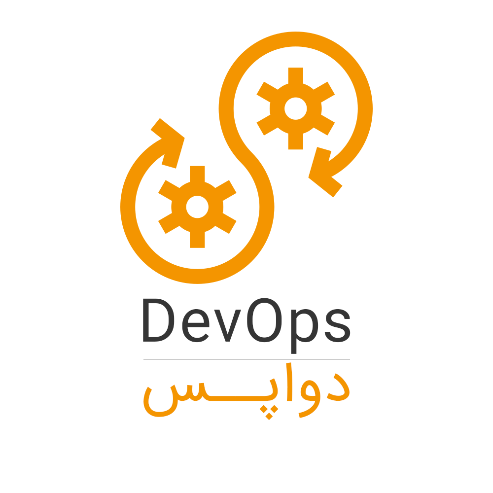
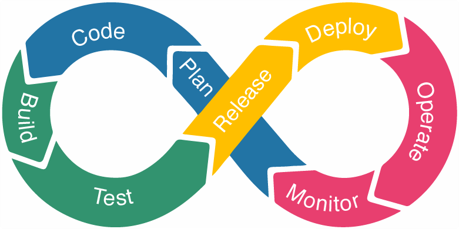
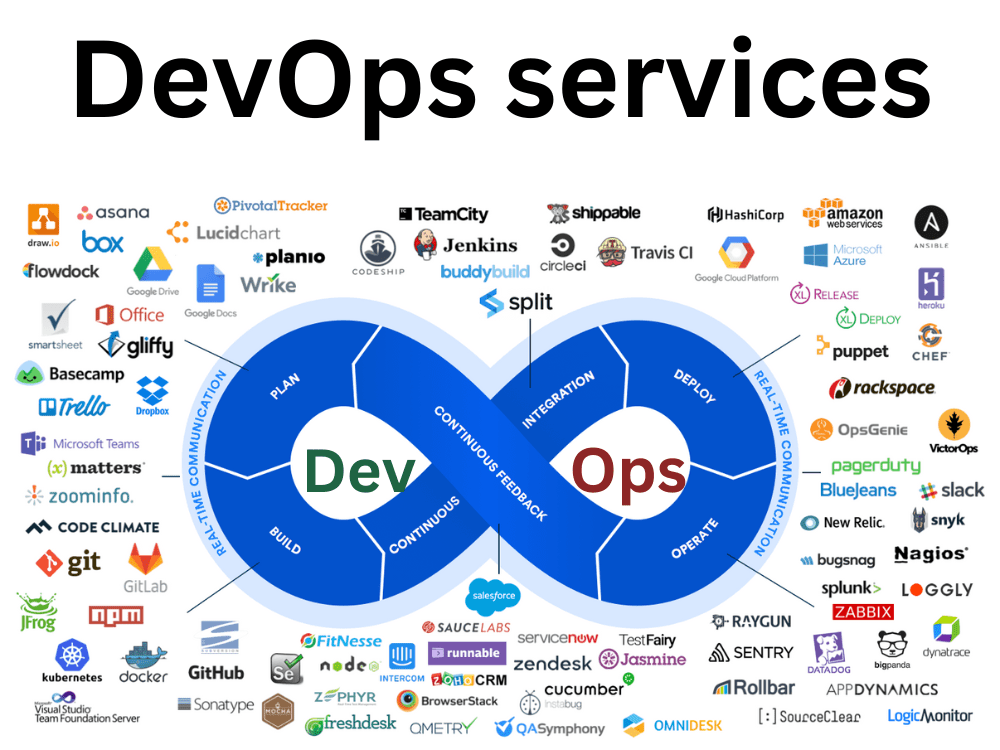
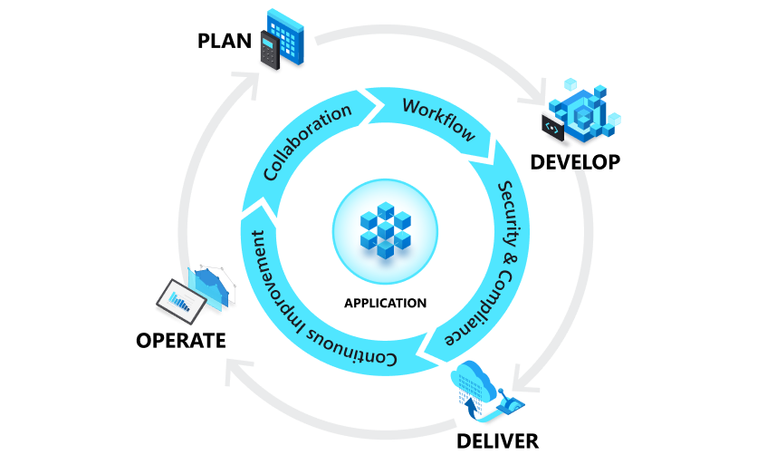

###  **DevOps یا دواپس چیست؟**

DevOps از دو کلمه‌ی Development (توسعه) و Operation (عملیات) تشکیل شده و به نوعی این دو مفهوم را با هم ترکیب کرده است. دواپس بین تیم توسعه‌ی محصول و تیم عملیاتی شرکت، همکاری و تعامل ایجاد می‌کند DevOps یک زبان یا یک تکنولوژی خاص نیست بلکه ترکیبی از فلسفه، فرهنگ، شیوه‌ها و ابزارهایی است که کمک می‌کنند محصولات یا خدمات ما سریع‌تر به دست مشتریان برسد.

منظور از  Development، تیم توسعه است، یعنی تمام کسانی که در ساخت محصول، خطایابی، تست و در نهایت تکمیل محصول نقش دارند. منظور از Operation هم IT Operation یا تیم عملیاتی است. افرادی که در حالت کلی، نگهداری تجهیزات سخت افزاری، نرم افزاری، و محیط‌های عملیاتی شرکت را به عهده دارند. DevOps به سازمان‌ها کمک می‌کند تا سرعت انتقال محصولات یا خدمات خود به مشتریان را افزایش دهند، کیفیت کار را بالا نگه دارند و حضور قدرتمندی در بازار داشته باشند.

تا قبل از DevOps، تیم‌های توسعه و عملیاتی در دو محیط ایزوله و جدا از هم فعالیت داشتند. جدا بودن برنامه‌ی کاری این دو تیم باعث ایجاد تاخیر در تحویل و تکمیل پروژه می‌شد. آن زمان بدون DevOps بیشتر وقت اعضای تیم به طراحی، تست و استقرار می‌گذشت به جای این که وقت برای ساخت پروژه واقعی صرف شود.

###  **رابطه‌ی Agile با DevOps**

 

قبل از صحبت درباره‌ی DevOps بهتر است کمی درباره‌ی مدل Agile (اجایل) و متدهای آن صحبت کنیم. Agile یا چابک برازنده‌ی نامی است که یدک می‌کشد و در پروژه باعث افزایش سرعت و بهره‌وری می‌شود. بعضی از متدهای معروف Agile که در شرکت‌های نرم افزاری به کار گرفته می‌شوند، عبارتند از اسکرام، XP ، AUP و... . با این که هر کدام از این متدها ساختار جداگانه و مستقل خود را دارند، اما در پایان به رشد مجموعه و بالا بردن کیفیت ختم می‌شوند. در این متدها مرتب با تکرار و گرفتن بازخورد (Feedback) سروکارداریم. Agile به افراد تیم کمک می‌کند تا در کنار هم، با سرعت بالا و حفظ کیفیت، تصمیم گرفته و پروژه را پیش ببرند.

نقطه‌ی اشتراک اصلی دواپس و متد اجایل، سرعت است. هر دو تکنولوژی می‌خواهند چرخه‌ی رسیدن نرم افزار به مشتری نهایی را تا حد ممکن کوتاه کنند.

???+ info "اجایل چیست؟"

    [جهت مشاهده اطلاعات بیشتر درخصوص متد اجایل (روش چابک) کلیک کنید](/page-agile)

###  **DevOps چه تفاوتی با روش‌های سنتی توسعه نرم افزار دارد؟**

DevOps تغییرات قابل توجهی در ساخت و توسعه‌ی محصول ایجاد کرده است. بهتر است برای درک مفهوم دواپس از یک مثال استفاده کنیم و در این مثال، تفاوت بین روش‌های سنتی و DevOps را بررسی کنیم.

سناریوی ما به این شکل است که فرض می‌کنیم پروژه‌ی ما ساخت یک اپلیکیشن است و قرار است تا دو هفته‌ی دیگر این اپلیکیشن را بررسی کنیم. تا اینجای کار 80% برنامه نویسی پروژه انجام شده است و در حال خرید سرور برای آنلاین کردن پروژه و انتقال کدها به سرور هستیم. این سناریو را با استفاده از هر دو روش سنتی و دواپس، بررسی می‌کنیم:

تیم توسعه در روش کلاسیک، سرورهای جدید را فعال می‌کنند و کار آزمایش و تست روی پروژه آغاز می‌شود. از سوی دیگر، تیم عملیاتی مستندات پروژه را می‌نویسند و زیرساخت‌های موردنیاز را بررسی می‌کنند. در روش DevOps بعد از اینکه نیاز به سرورهای جدید احساس شد، قبل از اینکه تیم سفارشی ثبت کند، هر دو واحد توسعه و عملیات در کنار هم روی مستندسازی و کاغذبازی کار می‌کنند تا به خوبی نیازهای پروژه را پیدا کنند. سپس سرورهای جدید را تهیه می‌کنند.

در روش سنتی، برنامه نویسانی که در حال کار بر روی پروژه هستند، بهتر از هر کسی می‌توانند در مورد مواردی مثل کانفیگ سرورها، موقعیت مکانی آن‌ها، ترافیکی که برنامه احتمالا خواهد داشت و... تصمیم گیری کنند. اما معمولا به دلیل جدا بودن دو بخش توسعه و عملیات، توسعه دهندگان در این موارد دخالتی نمی‌کنند. در روش DevOps، توسعه‌دهندگان اطلاعات خود را در اختیار تیم عملیاتی قرار می‌دهند و آن‌ها نیز از این ورودی‌ها در انتخاب سرور استفاده می‌کنند.

در روش سنتی، تیم عملیاتی اطلاعی از مراحل ساخت نرم افزار ندارند و کارهای نظارتی و بررسی را با توجه به درک خود از پروژه انجام می‌دهند. در روش DevOps، تیم عملیاتی کاملا در جریان پیشرفت پروژه و مراحلی طی شده هستند. از آنجا که تیم‌های توسعه و عملیاتی با هم در تعامل هستند، می‌توانند با توجه به نیازهای IT و تجارت، یک برنامه‌ی نظارتی مشترک طراحی کنند. همچنین ابزارهای مانیتورینگ یا APM) Application Performance Monitoring)  هم استفاده می‌شود.

در روش سنتی، قبل از آنلاین کردن برنامه، تست‌هایی روی آن انجام می‌شود تا عملکرد برنامه برای آخرین بار تست شود. در این حالت ممکن است برنامه به مشکل خورده یا به کل از کار بیفتد. در این شرایط انتشار برنامه به تاخیر می‌افتد. در روش DevOps قبل از انتشار نهایی، یک تست روی برنامه اجرا شده و کمی سرعت آن افت می‌کند. تیم توسعه به سرعت گلوگاه‌ها را تشخیص داده و مشکلات اصلی را برطرف می‌کنند. هیچ مشکلی در نظم کاری به وجود نیامده و برنامه طبق زمانبندی قبلی منتشر می‌شود.

###  **چرخه حیات (Life cycle) دواپس**

چرخه حیات DevOps به 8 بخش کلی تقسیم می‌شود:

{++

*   برنامه ریزی
*   کد
*   ساخت
*   آزمایش
*   انتشار
*   استقرار  
*   عملیات
*   مانیتورینگ

++}

### **مزایای استفاده از دواپس چیست؟**

بعد از پاسخ به سوال «دواپس چیست و چه کاربردی دارد؟» نوبت به مزایای دواپس رسیده است.

 با استفاده از ابزار (Continuous Integration) CI نرم‌افزارهای Build شده و تست‌های نرم‌افزاری اعم از unit و  integration testها به‌صورت خودکار اجرا می‌شوند.

ابزار CD (Continuous delivery) نیز فرایند release نرم‌افزار نهایی را به‌صورت خودکار انجام می‌دهد. این ابزارها باعث می‌شود که محصول نهایی سریع‌تر به دست مشتری برسد.

**برخی از مزایای دواپس به شرح زیر است:**

*   پیش‌بینی شکست یا موفقیت محصول قبل از تولید آن
*   همکاری با سایر اعضا برای رفع مشکلات و چالش‌ها
*   بهبود سرعت ارائه محصول به بازار
*   یکپارچه سازی، خودکارسازی و تحویل مستمر (CI/CD)
*   رفع سریع و اسان مشکلات نرم‌افزاری
*   صرفه‌جویی در هزینه‌ها و منابع
*   افزایش کارایی و کیفیت محصول
*   خلاقیت و نوآوری
*   رضایت مشتریان
*   کاهش ریسک شکست

### **ابزارهای مورد نیاز برای مهندس DevOps چیست؟**

**برخی از مهمترین ابزارهای کاربردی برای مهندس دواپس عبارتند از:**

  Apache Maven : محیطی برای توسعه (برنامه نویسی) و مدیریت پروژه‌های نرم‌افزاری.

  Gradle : مانند Apache Maven  محیطی برای توسعه و مدیریت پروژه‌های نرم‌افزاری.

  Git : گیت یک سیستم وژن کنترل برای مدیریت بهتر پروژه‌ها.

  Jenkins: یک ابزار CI/CD متن باز رایگان برای خودکارسازی فرآیندهای مرتبط با دواپس.

  Bamboo : بامبو نیز مانند Jenkins یک ابزار برای خودکارسازی فرآیند ساخت پروژه است. اما برخلاف Jenkins قسمت‌های رایگان آن بسیار محدود است و استفاده از آن نیاز به خرید اشتراک است.

  Docker : داکر محیطی یکپارچه و ایزوله برای مدیریت پروژه‌ها است.

 Kubernetes : کوبرنتیس نیز مانند داکر محیطی برای یکپارچه‌سازی و ایزوله کردن پروژه‌ها است.

Puppet : سرویس زیرساختی برای کد را به کسب و کارها ارائه می‌دهد. این ابزار با خودکارسازی فرآیندهای زیرساخت سیستم، سرعت انتشار محصول در بازار را افزایش می‌دهد.

### **DevOps و چرخه عمر برنامه (اپلیکیشن)**

DevOps بر چرخه عمر اپلیکیشن در طول مراحل برنامه ریزی، توسعه، تحویل و عملیات تأثیر می گذارد. هر فاز به فازهای دیگر متکی است و فازها وابسته به نقش نیستند. فرهنگ DevOps همه نقش ها را در هر مرحله تا حدی شامل می شود.

نمودار زیر مراحل چرخه حیات برنامه DevOps را نشان می دهد:

#### **برنامه ریزی (Planning)**

در مرحله برنامه ‌ریزی، تیم‌ های DevOps ویژگی ‌ها و قابلیت ‌های برنامه‌ ها و سیستم‌ هایی را که می‌ خواهند بسازند، طراحی، تعریف و توصیف می‌ کنند. تیم ‌ها پیشرفت کار را در سطوح پایین و بالا از ابتدا و از مجموعه‌ های تک محصولی تا چند محصولی پیگیری می ‌کنند. تیم ها از روش های DevOps زیر برای برنامه ریزی چابک (Agile) و نظارت بر کار استفاده می کنند.

*   ایجاد بک لاگ (Backlog) – لیست کارهایی که باید در تولید محصول یا پروژه پیاده سازی و اجرا شوند.
*   ردیابی مشکلات
*   مدیریت توسعه نرم افزار Agile با اسکرام
*   ایجاد بوردهای کانبان برای مشاهده بصری گردش کار
*   استفاده از نرم افزارهای مختلف برای بصری سازی پیشرفت کار

#### **توسعه (Development)**

این مرحله شامل توسعه در تمام کدهای نرم افزار است. در این مرحله، تیم های DevOps وظایف زیر را انجام می دهند:

*   انتخاب محیط توسعه
*   نوشتن، آزمایش، مرور و یکپارچه سازی کدها
*   نوشتن کدها در محیط های مصنوعی برای استقرار در محیط های مختلف
*   استفاده از Git برای همکاری در نوشتن کدها و کار به صورت موازی

#### **تحویل (Delivery)**

تحویل یا Delivery، فرآیند استقرار مداوم برنامه ها در محیط های تولید، از طریق تحویل مداوم (CD) است.

در فاز تحویل، تیم های DevOps :

*   یک فرآیند مدیریت انتشار (release management process) را با مراحل تأیید دستی تعریف می کنند.
*   دروازه های خودکار (automated gates) را برای جابجایی برنامه ها بین مراحل مختلف تا انتشار نهایی برای مشتریان تنظیم می کنند.
*   فرآیندهای تحویل را اتومات می کنند تا مقیاس پذیر، تکرارپذیر، کنترل شده و به خوبی آزمایش شوند.

تحویل همچنین شامل استقرار و پیکربندی زیرساخت های بنیادی محیط تحویل است. تیم‌ های DevOps از فناوری‌ هایی مانند “زیرساخت به‌عنوان کد(IaC) ، کانتینرها و میکروسرویس‌ ها برای ارائه محیط‌ های زیرساختی کاملاً تحت کنترل استفاده می‌ کنند.

روش های استقرار ایمن می ‌توانند مشکلات را قبل از تأثیرگذاری بر تجربه مشتری شناسایی کنند. این شیوه‌ ها به تیم ‌های DevOps کمک می ‌کنند تا مکرراً با سهولت، اطمینان و آرامش خاطر کار خود را ارائه دهند.

#### **عملیات (Operations)**

مرحله عملیات شامل نگهداری، نظارت و عیب ‌یابی برنامه ‌ها در محیط ‌های تولید، از جمله ابرهای ترکیبی یا عمومی مانند Azure است. هدف تیم های DevOps ایجاد قابلیت اطمینان در سیستم، در دسترس بودن بالا، امنیت قوی و عدم توقف زمان است.

تحویل خودکار و شیوه‌ های استقرار ایمن به تیم ‌ها کمک می‌کند تا مشکلات را در صورت بروز، سریعا شناسایی و برطرف کنند.

### **مزایای DevOps**

#### **سرعت**

DevOps به توسعه‌دهندگان و تیم‌های عملیاتی این امکان را می‌دهد تا به این نتایج دست پیدا کنند. به عنوان مثال، میکروسرویس‌ها و تحویل پیوسته  (CD)به تیم‌ها اجازه می‌دهد تا مالکیت سرویس‌ها را در دست بگیرند و با سرعت بیشتری آن‌ها را به‌روز و آپدیت کنند.

#### **تحویل سریع**

افزایش سرعت و تعداد ریلیزهای محصول باعث می‌شود تا محصولتان را با سرعت بیشتری بهبود دهید و میزان نوآوری در ارائه محصول را افزایش دهید. 

هر چقدر با سرعت بیشتری بتوانید فیچرهای جدید ارائه کنید و مشکلات بیشتری را برطرف کنید، به همان سرعت می‌توانید به نیازهای بیشتری از مشتری پاسخ دهید و در نتیجه برای خود مزیت رقابتی بسازید. یکپارچه‌سازی مداوم (CI) و تحویل مداوم(CD)، عملیاتی هستند که فرایند انتشار نرم‌افزار را از ساخت تا استقرار به‌صورت خودکار انجام می‌دهند.

#### **قابلیت اعتماد**

با این ویژگی می‌توان کیفیت آپدیت‌های نرم‌افزار و تغییرات زیرساختی را تضمین کرد. همچنین تحویل قابل اعتماد و سریع ، می‌تواند یک تجربه مثبت برای کاربران نهایی بسازد.

با استفاده از روش‌هایی مانند یکپارچگی مداوم(CI) و تحویل مداوم(CD)، می‌توانید هر تغییری را بررسی و تست کنید تا اطمینان از عملکرد و امنیت همچنان حفظ شود. روش‌های مانیتورینگ و ثبت رویداد‌ها (لاگ)  نیز به شما کمک می‌کنند تا به‌صورت زمان‌بندی شده از عملکرد نرم‌افزار با خبر شوید.

#### **مقیاس‌پذیری**

مدیریت زیرساخت‌ها و فرایندهای توسعه خود را در مقیاس بزرگ انجام دهید. خودکارسازی و تطابق به شما کمک می‌کند تا با خطر کمتری، سیستم‌های پیچیده یا قابل تغییر را مدیریت کنید. به‌عنوان مثال، زیرساخت به عنوان کد (IaC) به شما کمک می‌کند تا محیط‌های توسعه، تست و تولید خود را به‌صورت تکرارپذیر و بهینه‌تر مدیریت کنید.

#### **همکاری بهتر و با کیفیت‌تر**

ایجاد تیم‌های بهتر و کارآمدتر در چارچوب فرهنگی DevOps با تمرکز بر ارزش‌هایی مانند مسئولیت و احساس مالکیت محصول، از دیگر ویژگی‌های DevOps به شمار می‌رود.

در فرهنگ دواپس، توسعه‌دهندگان و تیم‌های عملیات، همواره همکاری نزدیکی با هم دارند، و در انجام مسئولیت‌های مختلف با هم سهیم هستند. این عمل باعث می‌شود نارسایی‌ها و خطاها کاهش یافته و در زمان صرفه‌جویی شود.

#### **امنیت**

با حفظ کنترل و رعایت پایبندی به قوانین، سرعت حرکت خود را بیشتر کنید. شما می‌توانید بی آنکه امنیت به خطر بیفتد یک مدل DevOps را با استفاده از سیاست‌های اتوماتیک‌سازی ، مانیتورینگ دقیق و تکنیک‌های مدیریت پیکربندی به‌کار بگیرید. به‌عنوان مثال، با استفاده از زیرساخت به عنوان کد (IaC) و پالیسی به‌عنوان کد، شما می‌توانید چالش‌های مربوط به امنیت سرویس‌هایتان را کاهش دهید.

#### **جمع‌بندی**

در معماری مدرن نرم‌افزار، دواپس جزو تکنولوژی‌هایی است که حضور ثابتی داشته و بسیاری از شرکت‌های امروزی به آن نیاز دارند. در واقع بدون استفاده از رویکردهای DevOps توسعه و استقرار اپلیکیشن تقریبا غیر ممکن است.

برای مثال توسعه اپلیکیشن‌ها براساس معماری میکروسرویس بدون کمک گرفتن از DevOps امکان‌پذیر نخواهد بود. 

**منابع**

*   [getpancake](https://getpancake.com/fa/devops/devops/)
*   [sananetco](https://sananetco.com/%D8%AF%D9%88%D8%A7%D9%BE%D8%B3-%DA%86%DB%8C%D8%B3%D8%AA/)
*   [همراه وش](https://hamravesh.com/blog/what-is-devops/)
*   [کسب و کار](https://karokasb.org/devops-lifecycle/)
*   [simform](https://www.simform.com/blog/devops-lifecycle/)