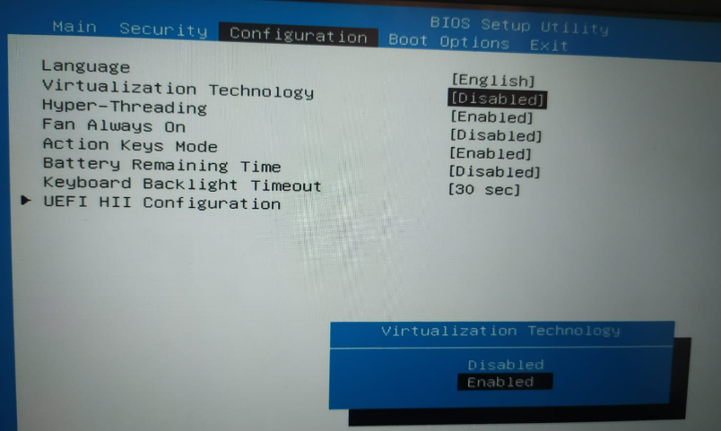
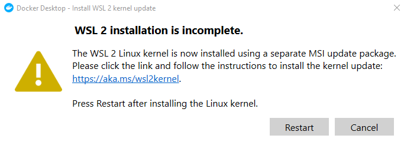

### **Docker چیست؟**

(داکر) Docker یک پلتفرم متن‌باز است که به توسعه‌دهندگان و مدیران سیستم امکان می‌دهد تا برنامه‌ها را به‌همراه وابستگی‌هایشان در بسته‌هایی به نام " کانتینر " (**Container**) بسته‌بندی، اجرا و مدیریت کنند. کانتینرها محیطی ایزوله فراهم می‌کنند که در آن می‌توان نرم‌افزارها را مستقل از سیستم‌عامل میزبان اجرا کرد، به طوری که همه چیز مورد نیاز برای اجرای نرم‌افزار از جمله کتابخانه‌ها و تنظیمات سیستم درون کانتینر موجود است.

مزیت اصلی Docker این است که با استفاده از کانتینرها، می‌توان به راحتی برنامه‌ها را از محیط توسعه به محیط تولید منتقل کرد، بدون نگرانی از ناسازگاری‌های سیستم‌عامل یا وابستگی‌ها. این قابلیت، توسعه‌دهندگان را قادر می‌سازد تا برنامه‌ها را سریع‌تر و با اطمینان بیشتری منتشر کنند. همچنین، Docker امکان مقیاس‌پذیری بهتر و مدیریت آسان‌تر زیرساخت‌های نرم‌افزاری را فراهم می‌کند، که این ویژگی‌ها به خصوص در محیط‌های ابری و معماری‌های میکروسرویس بسیار مفید هستند.

به بیان ساده‌تر، داکر ابزاری است که به برنامه نویسان، توسعه دهندگان، ادمین‌های سیستم (Sys-Admins) و سایر افراد اجازه می‌دهد تا به راحتی برنامه‌های توسعه داده شده خود را در یک Sandbox (جعبه شنی) که به آن کانتینر گفته می‌شود، روی سیستم عامل میزبان (که همان لینوکس باشد) اجرا کنند.

Sandbox یک ناحیه آزمایشی روی یک سیستم کامپیوتری به حساب می‌آید که در آن می‌توان بدون تاثیر بر سخت افزار یا نرم افزار دیگر، یک برنامه نرم افزاری را اجرا کرد. مزیت کلیدی داکر این است که به کاربران اجازه می‌دهد تا یک اپلیکیشن را به همراه تمام متعلقاتش (ضمایم | Dependancies) در یک واحد استانداردسازی شده برای توسعه نرم افزار بسته‌بندی کنند. بر خلاف ماشین‌های مجازی (Virtual Machine | VM) کانتینرها سربار (Overhead) بالایی ندارند و از این رو امکان استفاده از سیستم زیربنایی و منابع را به صورت بهینه‌تر فراهم می‌کنند.

### **Docker Container  چیست ؟**

داکرکانتینر یک واحد استاندارد نرم افزاری است که کدها را به همراه تمام متعلقاتش (وابستگی‌هایش) بسته‌بندی می‌کند تا امکان اجرای سریع و قابل اطمینان اپلیکیشن توسعه داده شده در محیط‌های محاسباتی مختلف فراهم شود.

فناوری کانتینر داکر در سال ۱۳۹۲ (۲۰۱۳ میلادی) به عنوان یک موتور داکر متن باز منتشر شد. در این فناوری، مفاهیم محاسباتی موجود در زمینه کانتینرها و خصوصاً مفاهیم اولیه‌ای در دنیای لینوکس، مثل cgroupها و فضای نام (Namespace) به کار گرفته شده‌اند. فناوری داکر به این دلیل منحصر به فرد است که بر نیازمندی‌های توسعه دهندگان و اپراتورهای سیستم برای جداسازی متعلقات سیستمی از زیرساخت‌شان تمرکز دارد.

### **ویژگی های کانتینر داکر چیست؟**

*   **استاندارد :**داکر استاندارد صنعتی برای کانتینرها را ایجاد کرده است تا این کانتینرها در همه جا به صورت قابل حمل در دسترس باشند.
*   **حجم کم :**کانتینرها کرنل سیستم عامل یک ماشین را به اشتراک می‌گذارند و بنابراین نیازی به یک سیستم عامل برای هر اپلیکیشن وجود ندارد. این رویکرد منجر به افزایش کارایی سرور و کاهش هزینه‌های سرور و صدور مجوز خواهد شد.
*   **امنیت:** با کانتینربندی یک اپلیکیشن، امنیت آن افزایش پیدا می‌کند و داکر قابلیت‌های پیش‌فرض ایزوله‌سازی را در صنعت فراهم ساخته است.

### **Container Image در داکر چیست؟**

Container image  (کانتینر ایمیج)‌ در داکر به یک بسته نرم افزاری اجرایی مستقل و کم حجم گفته می‌شود که حاوی تمام موارد مورد نیاز برای اجرای یک اپلیکیشن (برنامه نرم افزاری) است. این موارد مورد نیاز در ادامه فهرست شده‌اند:

*   کدها
*   زمان اجرا (Runtime)
*   ابزارهای سیستمی
*   کتابخانه‌های سیستمی
*   تنظیمات

کانتینر ایمیج‌ها در زمان اجرا تبدیل به کانتینر می‌شوند و در خصوص کانتینرهای داکر، ایمیج‌ها زمانی تبدیل به کانتینر می‌شوند که روی موتور داکر (Docker Engine) اجرا شوند. هم برای اپلیکیشن‌های ویندوزی و هم لینوکسی یک نرم افزار کانتینربندی شده (محفظه‌بندی شده) جدا از زیرساختش همیشه به صورت یکسان اجرا خواهد شد. کانتینرها نرم افزار را از محیط خود جداسازی و اطمینان حاصل می‌کنند که برخلاف تفاوت‌ها برای مثال بین مراحل توسعه و ناحیه‌بندی (Staging | در استقرار نرم افزار) برنامه به طور یکدست و یکنواخت کار می‌کند.

### **تفاوت کانتینر با ماشین مجازی چیست؟**

مزیت‌های استفاده از ساز و کارهای ایزوله‌سازی و تخصیص منابع در کانتینرها و ماشین‌های مجازی مشابه هستند، اما عملکرد این دو برای انجام چنین کاری متفاوت است؛ زیرا کانتینرها به جای مجازی سازی سخت افزار، سیستم عامل را مجازی سازی می‌کنند. کانتینرها قابلیت حمل بیش‌تری دارند و نسبت به ماشین مجازی بهینه‌تر عمل می‌کنند.

ماشین‌های مجازی یا همان VMها انتزاعی از سخت افزار فیزیکی به حساب می‌آیند که یک سرور را به چندین سرور تبدیل می‌کنند. لایه نرم افزاری برای ایجاد محیط مجازی که به آن «Hypervisor» می‌گویند، به چندین ماشین مجازی امکان می‌دهد تا روی یک ماشین واحد اجرا شوند. هر ماشین مجازی شامل یک نسخه کامل از سیستم عامل، اپلیکیشن، عملیات باینری، کتابخانه‌های مورد نیاز و سایر موارد است که ده‌ها گیگابایت فضا اشغال می‌کنند. علاوه بر این، بوت شدن ماشین‌های مجازی معمولاً بسیار کند است.

از طرف دیگر، کانتینرها انتزاعی در لایه اپلیکیشن محسوب می‌شوند که کدها و وابستگی‌های آن‌ها را به همراه هم بسته‌بندی می‌کنند. چندین کانتینر قابلیت اجرا روی یک ماشین مشترک را دارند و این امکان وجود دارد که هسته یا همان کرنل سیستم عامل با سایر کانتینرها به اشتراک گذاشته شود و هر کدام از آن‌ها در فضای کاربر به صورت پردازه‌های مجزا و مستقل اجرا شوند. کانتینرها فضای کم‌تری را نسبت به ماشین‌های مجازی اشغال می‌کنند (ایمیج‌های کانتینر به طور معمول تنها حجمی معادل چند ده مگابایت دارند). علاوه بر این، کانتینرها می‌توانند اپلیکیشن‌های بیش‌تری را تحمل کنند و با استفاده از آن‌ها نیاز به ماشین‌های مجازی و سیستم عامل‌های کم‌تری وجود دارد.


### **داکر دسکتاپ (Desktop Docker)**

داکر دسکتاپ یک برنامه برای محیط ویندوزا لینوکس و مک است که کاربر را قادر می سازد برنامه های کانتینری را بسازد و به اشتراک بگذارد. این برنامه خود شامل داکر دیمون، داکر کلاینت، موتور داکر و تمامی ابزارهای دیگر موردنیاز راه اندازی این سیستم است و یک رابط کاربری گرافیکی بسیارساده فراهم آورده است تا کاربر به طور مستقیم برنامه ها، کانتینرها و ایمیج

های خود را از روی سییستم مدیریت کند.

### **ایمیج داکر (Image Docker)**

ایمیج یا تصویر داکر یک قالب از دستورالعمل های ساخت کانتینر داکر است که در وضعیت فقط خواندنی  (read-only) می‌باشد.

معموالا هر ایمیج بر اساس یک ایمیج دیگر به همراه مقداری سفارشی سازی ساخته می‌شود.  کاربر می تواند ایمیج های داکر مخصوص به خود را بسازد و یا از آن هایی که در رجیستری موجود هستند استفاده نماید. 

برای ساخت یک ایمیج، کاربر یک داکر فایل (Docker File) با استفاده از دستورات ساده ای ایجاد می کند که گام های مورد نیاز برای ساخت و راه اندازی ایمیج را در آن تعریف می کند. 

ایمیج ها ساختار لایه بندی شده ای دارند که هرکدام به طور مجزا قابل بازنویسی و ساخت مجدد هستند که از ویژگی های مهم آن‌ها می‌توان به این موضوع اشاره کرد که در صورت تغییر در یک ایمیج تنها لایه مربوطه که تغییرات داشته بازسازی می‌شود و به همین دلیل ایمیج ها در مقایسه با سایر روش های مجازی سازی بسیار سبک و سریع هستند.


### **داکر هاب (Docker Hub)**

داکر هاب یک سرویس استاندارد است که از طرف خود Docker ارائه شده است. این سرویس Cloud-Base بوده و کاربران می‌توانند ایمیج کانتینرهای داکر خود را در آن Push کنند.

برای مشاهده و جستجوی ایمیج ها می توانید به آدرس https://hub.docker.com مراجعه کنید.

همچنین هر زمان که بخواهند می‌توانند براساس نیازشان از منابع متفاوت ایمیج کانتینرهای مختلف را Pull کنند. 


### **آموزش نصب داکر**

برای نصب داکر می توانید از سایت اصلی به نشانی ([https://www.docker.com](https://www.docker.com)) بر اساس نوع سیستم عامل خود برنامه داکر را بارگیری نمایید.


پس از نصب و اجرای برنامه داکر ممکن است با پیام فعال سازی مجازی سازی (virtualization) مواجه شوید، برای فعال سازی مجازی سازی در سیستم خود کافیست، سیستم خود را رستارت کرده و وارد محیط (BIOS) سیستم شوید.


جهت وارد شدن به محیط بایوس می بایست، یکی از کلید های Del یا Tab و... بر اساس نوع سخت افزار خود فشار دهید.

سپس بدنبال گزینه virtualization بگردید (در سخت افزار مختلف این کلمه، کلمه کلیدی است)، و به حالت enabled آن را تغییر دهید، تنظیمات را ذخیره کنید و خارج شوید.



در برخی از سخت افزار ها بصورت مخفف (SVM) نوشته می گردد.


همچنین در صورتی که پس از فعال سازی همچنان دچار مشکل بودید، نصب بودن پکیج Hyper-V را از مسیر Windows Features بررسی کنید.

وارد Control Panel و گزینه Programs شوید:


برروی Turn Windows features on or off کلیک کنید:


تیک گزینه Hyper-V را فعال کنید. 


### **نصب WSL**

جهت استفاده از داکر می بایست WSL در سیستم عامل ویندوز نصب باشد،  روش های مختلفی جهت نصب وجود دارند که بهترین روش آن نصب مستقیم WSL می باشد.

لینک دانلود +



پس از طی کردن مراحل مذکور برنامه داکر با موفقیت اجرا می‌گردد.


همچنین می توانید برای بررسی نصب داکر دستور docker -v را در محیط CMD وارد کنید و اینتر کنید.


### **آشنایی با دستورات داکر**

### **دستور Docker version**

معمولا با یافتن نسخه نصب شده docker که روی آن کار می کنیم شروع می کنیم. 

```plaintext
docker –version
```

### **دستور Docker search**

ایمیج خاصی را از طریق داکر هاب جستجو می کند. این دستور اطلاعات خاصی از جمله نام image، توضیحات، خودکار، ستاره‌های رسمی و غیره را برمی‌گرداند. 

```plaintext
docker search MySQL
```

می توانید از وب سایت Docker Hub برای جستجو از طریق گزینه مبتنی بر رابط کاربری گرافیکی استفاده کنید.

### **دستور Docker pull**

همانطور که از نام آن پیداست، این دستور یک image خاص را از داکر هاب می کشد. تنها کاری که باید انجام دهید این است که از دستور docker pull به همراه نام image استفاده کنید. در ادامه نمونه‌ای از pull یک ایمیج بدون استفاده از تگ آورده شده است:

```plaintext
docker pull --platform Linux/x86_64 MySQL
```

تگ ها برای شناسایی ایمیج‌های داخل داکر هاب استفاده می شوند. اگر تگی را مشخص نکنید، به طور پیش فرض از تگ : latest استفاده می کند.

ما می توانیم از دستور -all-tags برای بیرون کشیدن تمام imageها از مخزن برای چندین image استفاده کنیم.

### **دستور Docker run**

این دستور برای ایجاد یک کانتینر از یک ایمیج استفاده می شود. 

```plaintext
docker run --env MYSQL_ROOT_PASSWORD=my-secret-pw --detach mysql
```

گزینه –detach  کانتینر را اجرا می‌کند و گزینه –env برای تنظیم متغیر اجباری استفاده می‌شود. اگر از گزینه –name استفاده نکنید، داکر به طور تصادفی یک نام به کانتینر اختصاص می دهد.

### **دستور شروع کانتینر**

شما باید کانتینر خود را شروع کنید تا بتوانید از آن در داکر استفاده کنید. دستور زیر به شما کمک می‌کند ظرف چند ثانیه کانتینر خود را شروع کنید.

```plaintext
docker start CONTAINER_ID
```

### **دستور حذف کانتینر**

یکی از مهمترین دلایل افزایش قابل توجه محبوبیت کانتینر، توانایی آن است که به شما کمک می‌کند تا هر کانتینر را بدون تأثیر بر سیستم میزبان حذف کنید. برای این کار می‌توانید از دستور زیر استفاده کنید.

```plaintext
docker rm CONTAINER_ID
```

### **دستور Docker ps**

این دستور برای لیست کردن تمام کانتینرهای در حال اجرا در پس زمینه استفاده می شود. در ادامه نحوه انجام آن آمده است:

```plaintext
docker ps –all
```

### **دستور Docker images**

همانطور که قبلا گفته شد، تصاویر Docker برای توسعه دهندگان بسیار ضروری است و همچنین عنصر سازنده هر کانتینر می‌باشد. فراموش نکنید که پایه همه کانتینرها با استفاده از ایمیج ها در داکر ایجاد شده است. به همین دلیل اغلب توسعه دهندگان چندین ایمیج از Docker را در سیستم‌های خود نگه می‌دارند. با دستور زیر می‌توانید در کمترین زمان تمام ایمیج های موجود در سیستم خود را بررسی کنید.

```plaintext
docker images
```

اجرای این دستور داکر به شما کمک می‌کند تا تمامی ایمیج های Docker را به همراه مخزن، تگ‌ها و اندازه آنها بررسی کنید. اگر می‌خواهید IMAGE\_ID را واکشی کنید، می‌توانید از پسوند q- استفاده کنید.

```plaintext
docker images -q
```

### **دستور Docker stop**

دستور docker stop یک کانتینر را با استفاده از نام کانتینر یا شناسه آن متوقف می کند.

```plaintext
docker stop h7m52redeecc
```

### **دستور Docker restart**

این دستور برای راه اندازی مجدد کانتینر متوقف شده استفاده می شود. توصیه می شود پس از راه اندازی مجدد سیستم از این مورد استفاده کنید.

```plaintext
docker restart h7m52redeecc
```

### **دستور Docker kill**

این دستور برای توقف فوری کانتینر با kill کردن اجرای آن استفاده می شود. در حالی که دستور docker stop به خاموش کردن کانتینر در زمان خود کمک می کند، دستور docker kill آن را بلافاصله متوقف می کند. 

```plaintext
docker kill 09ca6feb6efc
```

### **دستور Docker exec**

این دستور برای دسترسی به کانتینری که در حال اجراست استفاده می شود. 

```plaintext
docker exec -it test_db bash
```

شما باید نام یا شناسه کانتینر را ارائه دهید که در این مورد test\_db است. گزینه های -i و -t برای دسترسی به حالت تعاملی استفاده می شوند.

### **دستور Docker login**

این دستور به شما کمک می کند تا به داکر هاب خود وارد شوید. همانطور که سعی می کنید وارد شوید، از شما خواسته می شود که اعتبار داکر هاب خود را بدهید.

```plaintext
docker login
```

### **دستور Docker commit**

این دستور برای ایجاد یا ذخیره ایمیجی از کانتینر ویرایش شده در سیستم لوکال استفاده می شود.

```plaintext
docker commit 09ca6feb6efc parsdev/httpd_image
```

### **دستور Docker push**

این دستور به فشار یا آپلود یک image داکر در مخزن یا داکر هاب کمک می کند. 

```plaintext
docker push parsdev/httpd_image
```

### **دستور Docker network**

دستور docker networ برای دانستن جزئیات لیست شبکه ها در کلاستر استفاده می شود. 

```plaintext
docker network ls
```

### **دستور Docker history**

این دستور برای بررسی تاریخچه یک image داکر استفاده می‌شود. هنگام استفاده از دستور باید نام ایمیج هم ذکر شود. 

```plaintext
docker history httpd
```

### **دستور Docker rmi**

این دستور برای آزاد کردن مقداری فضای دیسک استفاده می شود. هنگام استفاده از این دستور از شناسه image برای حذف آن استفاده می شود.

```plaintext
docker rmi eb0e825dc3cf
```

### **دستور Docker ps -a**

این دستور برای دانستن جزئیات همه کانتینرهای در حال اجرا، متوقف شده یا خارج شده استفاده می شود. 

```plaintext
docker ps -a
```

### **دستور Docker copy**

این دستور یک فایل را از docker به سیستم لوکال کپی می کند.

```plaintext
docker cp 09ca4feb7tfc:/usr/local/apache2/logs/httpd.pid /home/parsdev/
```

### **دستور Docker logs**

این دستور برای بررسی گزارش‌های تمام کانتینرهای docker با شناسه ذکر شده در دستور استفاده می‌شود. 

```plaintext
docker logs 09ca6feb6efc
```

### **دستور Docker volume**

این دستور یک حجم ایجاد می کند تا کانتینر docker بتواند از آن برای ذخیره داده ها استفاده کند. 

```plaintext
docker volume create
```

### **دستور Docker logout**

این دستور شما را از داکر هاب خارج می کند. 

```plaintext
docker logout
```