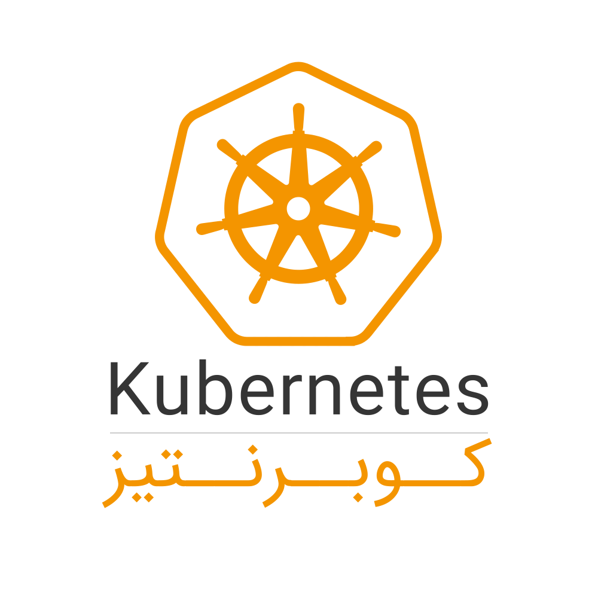
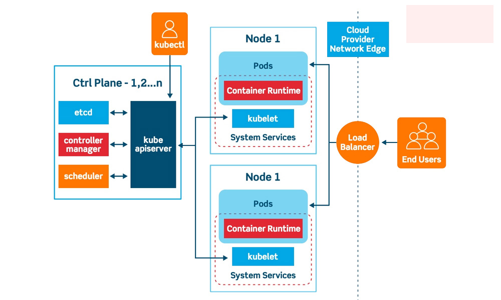

**کوبرنتیز چیست؟**

کوبرنتیز (Kubernetes) یک پلتفرم متن باز است که به برنامه‌های کاربردی کانتینری اختصاص داده شده است. این نام دارای ریشه یونانی و به معنای سکان دار یا خلبان است. خوب است که این را در پس ذهن خود نگه دارید، زیرا فهم جزئیات و نحوه عملکرد کوبرنتیز برای افراد مبتدی اصلا آسان نیست. در اصل، کوبرنتیز به توسعه و استقرار برنامه‌ها به شیوه‌ای ساده کمک می‌کند. در این روش تا حد امکان برنامه‌های نرم‌افزاری غیر ضروری حذف می‌شوند. کوبرنتیز را به عنوان سیستمی در نظر بگیرید که به توسعه دهندگان کمک می‌کند تا چندین کانتینر را به صورت همزمان در محیط‌های مختلف (فیزیکی، مجازی و یا ابری) اجرا کنند. به بیانی دیگر، در قلب هر پلتفرم کوبرنتیز چندین کانتینر قرار دارد. در حالت عادی در توسعه نرم افزار باید از کتابخانه‌های مختلف بهره ببرید و این کتابخانه‌ها گاهی اوقات روی خود کامپیوتر قرار دارند. اما همانطور که گفتیم، ایده اصلی کانتینر این است که تمام قسمت‌های غیر ضروری برنامه را بردارید و فقط قطعاتی از سیستم‌عامل (OS) که واقعا به آن‌ها نیاز دارید باقی بماند.

تصویر زیر یک نما از چگونگی کارکرد کوبرنتیز را نشان می‌دهد.

### **کلاستر**

کلاسترهای Kubernetes به کانتینرها اجازه می دهند که در چندین ماشین و محیط (مجازی، فیزیکی، ابری و داخلی) اجرا شوند و کانتینرهای مربوط به این فناوری به سیستم عامل خاصی محدود نمی شوند. هر کلاستر دارای دو بخش ماشین های محاسباتی (گره های کارگر) و بخش کنترلی (گره اصلی) است و هر کلاستر باید حداقل یک گره اصلی و یک گره کارگر داشته باشد. هر کدام از این گره ها، اجزای مربوط به خود را دارند:

### **مؤلفه‌های کوبرنتیز**

اکثر استقرارهای کارآمد Kubernetes روی زیرساخت‌های مجازی معمولی اجرا و تعداد فزاینده‌ای نیز روی سرورهای فیزیکی ساده پیاده می‌شوند. کوبرنتیز به‌عنوان ابزار مدیریت استقرار و چرخه عمر اپ‌های کانتینری کاربرد دارد و ابزارهای جداگانه‌ای نیز برای مدیریت منابع زیرساخت به‌کار می‌روند.

اجزای مختلف موردنیاز برای داشتن یک کلاستر کامل و کارآمد عبارتند از:

#### **۱.  اجزای سطح کنترل**

اجزای سطح کنترل تصمیمات کلی مثل زمان‌بندی کلاستر یا شناسایی و پاسخ به رویدادهای کلاستر را اتخاذ می‌کنند؛ مثلاً شروع پاد جدید درصورت ناقص‌بودن کپی استقرار. اجزای سطح کنترل را می‌توان روی هر ماشینی در کلاستر اجرا کرد؛ اما برای سهولت بیشتر معمولاً تمام اجزا در یک ماشین و کانتینرهای کاربر در ماشین دیگری اجرا می‌شوند.

#### **۲. kube-apiserver**

سرور API یکی از اجزای سطح کنترل است که API کوبرنتیز را برای ارتباط با سیستم منتشر می‌کند. این سرور برای سطح کنترل کوبرنتیز فرانت‌اند محسوب می‌شود. kube-apiserver پیاده‌سازی اصلی سرور API کوبرنتیز است که برای مقیاس‌بندی افقی طراحی شده است. به‌عبارت‌دیگر، با استقرار نمونه‌های بیشتر مقیاس آن هم بزرگ‌تر می‌شود. با اجرای چند نمونه از kube-apiserver ، می‌توانید ترافیک را متعادل کنید.

#### **۳. etcd**

 etcd مؤلفه ذخیره مقادیر مهم با قابلیت دسترسی درخورتوجه است که بین گره‌های مختلف توزیع می‌شود. وظیفه این مؤلفه ذخیره اطلاعات پیکربندی است و تنها ازطریق API سرور دردسترس قرار دارد؛ چرا‌که ممکن است حاوی داده‌های حساس باشد.

#### **۴. kube–scheduler**

این مؤلفه پادهای تازه‌ایجاد‌شده و بدون گره را پیدا می‌کند و گرهی را برای اجرا به آن‌ها اختصاص می‌دهد. معیارهای مهم برای زمان‌بندی تصمیمات این مؤلفه شامل الزامات منابع فردی و جمعی، محدودیت‌های سخت‌افزاری و نرم‌افزاری، محل داده‌ها، تداخل بارهای کاری و ضرب‌الأجل است.

#### **۵. kube-controller-manager**

این مؤلفه پردازه‌های کنترلر را اجرا می‌کند. ازنظر منطقی، هر کنترلر یک پردازه جداگانه است؛ اما برای کاهش پیچیدگی همه آن‌ها در یک باینری کامپایل و در یک پردازه اجرا می‌شوند. برخی از انواع این کنترلرها عبار‌ت‌اند از:

*   کنترلر گره: مسئول تشخیص و پاسخ‌دهی درصورت داون‌شدن گره
*   کنترلر EndpointSlice: برای ایجاد ارتباط بین سرویس‌ها و پادها، اشیای EndpointSlice را جمع‌آوری می‌کند.
*   کنترلر ServiceAccount: برای فضا نام جدید ServiceAccounts پیش‌فرض را ایجاد می‌کند.

#### **۶. cloud-controller-manager**  

این مؤلفه امکان برقراری ارتباط بین کلاستر و API ارائه‌کننده سرویس ابری را برایتان فراهم می‌کند. دیگر کاربرد آن جداسازی مؤلفه‌های مرتبط با پلتفرم ابری از مؤلفه‌های لینک‌شده به کلاستر است. cloud-controller-manager تنها آن دسته از کنترلرهایی را اجرا می‌کند که مختص سرویس‌دهنده ابری شما هستند. اگر Kubernetes را روی سیستم محلی یا در محیط آموزشی اجرا کنید، کلاستر مدیر کنترلر ابر نخواهد داشت.

این مؤلفه هم مثل kube-controller چندین حلقه کنترل مجزا را در یک باینری ترکیب می‌کند تا به‌عنوان یک پردازه اجرا شوند. این کنترلرها به سرویس‌دهنده ابری وابسته هستند:

*   کنترلر گره: بررسی سرویس‌دهنده برای اطمینان از حذف یک گره درصورت پاسخ‌گونبودن به درخواست‌ها
*   کنترلر مسیر: تنظیم مسیرها در زیرساخت ابری
*   کنترلر سرویس: ایجاد و به‌روزسانی و حذف متعادل‌کننده‌های بار سرویس‌دهنده

#### **۷. Pod**

پاد به‌عنوان کوچک‌ترین بخش کوبرنتیز شامل کانتینرهای مستقر در یک گره است و نقش بسیار مهمی در مدیریت اپلیکیشن کانتینری ایفا می‌کند. بین کانتینرهای یک پاد آدرس IP ،IPC، نام میزبان و دیگر منابع مشترک است. کانتینرهای درون یک پاد از آدرس IP مختلفی درمقایسه‌با کانتینر پادهای دیگر استفاده می‌کنند. بدون وجود پاد، اجزای اپلیکیشن یا سرویس باید روی ماشین مجازی یکسانی اجرا شوند؛ اما پاد شبکه و حافظه را از زیرساخت پایه مستقل می‌سازد تا پروژه روی زیرساخت‌های مختلف اجرا‌شدنی باشد.

در کوبرنتیز، کاربر می‌تواند شخصاً پاد ایجاد کند یا آن را به کنترلر بسپارد تا با بازدهی بیشتر این کار را انجام دهد. دلیل این بازدهی چشمگیر آن است که سرویس زمان‌بندی کوبرنتیز براساس تنظیمات و محل و محتویات پاد، بهترین گره را برایش پیدا می‌کند. در Kubernetes، ارتباط بین پادها به‌سادگی به‌واسطه سرویس‌ها شکل می‌گیرد. کانتینرها یکدیگر را ازطریق میزبان محلی پیدا و ازطریق استانداردهای مختلف مثل POSIX یا SystemV ارتباط برقرار می‌کنند.

در کوبرنتیز، می‌توانید برای هر پاد ماهیت و منابع مشخصی تعریف کنید. این مزیت به سیستم اجازه می‌دهد پادهای مرتبط به یکدیگر را در گره‌ای مناسب قرار دهد. برای مثال، اگر فرانت‌اند یک برنامه در پاد A یک گره قرار داشته باشد، قسمت بک‌اند را می‌توان در پاد B همان گره قرار داد تا به‌سادگی بین آن‌ها ارتباط برقرار شود.

پادها تا وقتی‌که کاربردی باشند یا حذف نشوند، در گره مشخص‌شده باقی خواهند ماند. با خاموش‌شدن هر گره، پادهای مربوط به آن براساس زمان‌بندی حذف خواهند شد تا منابع سیستم به‌هدر نرود.

#### **۸. کنترلر تکرار**

این کنترلر مشخص می‌کند که چه تعداد کپی مشابه از یک پاد باید در کلاستر اجرا شوند.

#### **۹. سرویس**

پراکسی سرویس کوبرنتیس به‌طورخودکار درخواست‌ها را به پاد مدنظر ارسال می‌کند. این مؤلفه حتی اگر پاد جایگزین یا جابه‌جا شده باشد، آن را پیدا می‌‌کند.

#### **۱۰. Namespace**

این سرویس راهی برای جداسازی فضاها در کوبرنتیز است. با دسته‌بندی اپ‌ها و منابع در Namespaceهای مجزا، می‌توان آن‌ها را به‌راحتی سازمان‌دهی کرد. برای مثال، اگر چند اپلیکیشن را در یک فضا قرار دهیم، باید نام‌های متفاوتی داشته باشند؛ اما با قرار‌دادن هرکدام در یک Namespace جداگانه، می‌توانیم اپ‌هایی با نام یکسان را در فضاهای متفاوت داشته باشیم. Namespace کلاسترها را به واحدهای هوشمند و ایزوله تبدیل می‌کند تا داده‌ها بهتر و آسان‌تر مدیریت شوند. Kubernetes به‌طورخودکار چهار Namespace را به منابعی اختصاص می‌دهد که مستقر شده‌اند؛ اما هنوز تعیین نشده‌اند. این‌ها عبارت‌اند از:

*   منابع مستقر
*   پیکربندی سیستم
*   کاربری سیستم
*   اشیای اجاره‌ای

تعداد Namespace ها محدودیتی ندارند و استفاده اصولی از آن‌ها در تفکیک بخش‌های تست و توسعه کمک زیادی به تیم پروژه می‌کند. برای مثال، اپ‌های کوچک به Namespace نیازی چندانی ندارند؛ اما برای میکروسرویس‌های متعدد می‌توانید از آن‌ها بهره ببرید.

### **Kubernetes چگونه کار می کند؟**

کوبرنتیز در بالای سیستم عامل اجرا می‌شود و با pod های گره‌ها در تعامل است. بخش کنترلی کلاستر، دستورات لازم را از مدیر یا تیم   DevOps می‌گیرد و آن دستورالعامل ها را به گره ها یا همان ماشین های محاسباتی منتقل می‌کند.

\*\* \*\*\*\*\*\*\*\*\* درمورد دواپس

این پروسه انتقال با سرویس های متعددی همراه می‌شود تا به طور خودکار تصمیم بگیرد که کدام گره برای این کار مناسب تر است. در ادامه، تخصیص منابع انجام می‌شود و pod های مربوط به گره موردنظر آن کار را اجرا می‌کنند.

حالت مطلوب یک کلاستر Kubernetes مشخص می‌کند که کدام برنامه ها یا بارهای کاری باید اجرا شوند، تصاویر(Images) مربوط به آنها، کدام منابع را درخواست می کنند و به چه نوع پیکربندی نیاز دارند.

کنترل های کاربر بر روی کانتینرها در سطح بالاتری اتفاق می‌افتد و نیازی به مدیریت دقیق و ریز کانتینرها و گره‌ها نیست و همین باعث می‌شود که کاربر وضعیت کانتینر را بهتر و راحت تر کنترل کند.

وظیفه کاربر، پیکربندی کوبرنتیز و تعریف گره‌ها، pod ها و کانتینرهای درون آن است. تمام کارهای مربوط به هماهنگی کانتینرها توسط خود کوبرنتیز انجام می‌شود.

اینکه این ابزار را در کجا اجرا کنید، کاملاً به شما بستگی دارد و بهتر است بدانید که در این زمینه دستتان باز است و می‌توانید سرورهای بدون سیستم عامل، ماشین های مجازی، سیستم های ابری خصوصی و … را هم انتخاب کنید. اصلاً مزیت اصلی این ابزار، امکان اجرای آن روی هر نوع زیرساختی است.

### **تفاوت Kubernetes و داکر**

اغلب کاربران در انتخاب بین این دو گیج می‌شوند و یا با همدیگر اشتباه می‌گیرند. این دو، فناوری های متفاوتی هستند ولی در عین حال به عنوان مکملی برای اجرای برنامه های کانتینری محسوب می‌شوند.

\*\*\*\*\*\*\*\*\* توضیح داکر لینک به داکر 

داکر این امکان را به شما می‌دهد هر آنچه که برای اجرای برنامه خود نیاز دارید را بسته بندی کنید و در هر زمان و مکانی که خواستید، ذخیره و اجرا کنید. وقتی این کار بسته بندی را انجام دادید، برای مدیریت آن نیاز به ابزاری دارید که این کار را هم کوبرنتیز برای شما انجام می‌دهد.

کوبرنتیز مسئول حمل و تحویل جعبه ها یا بسته ها به مکان هایی است که می‌توان از آنها استفاده کرد. این ابزار با داکر یا بدون آن قابل استفاده است. در‌کل، Docker جایگزینی برای کوبرنتیز نیست. استفاده از آن در کنار داکر برای کانتینری کردن برنامه ها و اجرای آنها است. تفاوت بین این دو در نقشی است که هر کدام در کانتینر کردن و اجرای برنامه ها دارند.

Docker کار بسته بندی و توزیع را انجام می دهد و Kubernetes هم از داکر برای دیپلوی، مدیریت و مقیاس بندی برنامه های کانتینری استفاده می‌کند.

### **موارد استفاده از کوبرنتیز**

دلیل اصلی این انتخاب سازمان ها، حذف نیاز به انجام کارهای خسته کننده ای مثل راه اندازی و توقف دستی کانتینرها یا اختصاص کانتینرها به سرورها است.

در واقع، اگر با یک پروسه دیپلوی کانتینر در مقیاس بزرگ مواجه هستید، این ابزار برای مدیریت محیط موردنظر ضروری است. شاید مدیریت یک یا دو نمونه کانتینر به صورت دستی کار راحتی باشد، اما مدیریت یک محیط برنامه با کانتنینرهای بیشتر به صورت دستی تقریباً غیر ممکن است.

با این که کوبرنتیز یک ابزار امنیتی نیست ولی این امکان را به شما می دهد که تکنیک های امنیتی خاصی مثل کنترل دسترسی بر اساس نقش و سیاست های امنیتی pod را به محیط برنامه های کانتینری اضافه کنید.

همچنین، انتقال اپلیکیشن از یک زیرساخت به زیرساخت دیگر با استفاده از Kubernetes راحت تر است چون می توان تنظیمات و داده ها را به زیرساخت های مختلف حمل کرد.

بهره مندی از قدرت محاسباتی بیشتر در اجرای اپلیکیشن ها و خودکارساری پروسه دیپلوی، زمان بندی و مدیریت کانتینرها در مجموعه بزرگی از ماشین ها و محیط ها (خصوصی، ابری و ترکیبی) به توسعه دهندگان کمک می کند که در این زمینه یک نفس راحت بکشند.

**منابع:**

[پارس پک](https://parspack.com/blog/hosting/cloud-container-tutorial/what-is-kubernetes#:~:text=%DA%A9%D9%88%D8%A8%D8%B1%D9%86%D8%AA%DB%8C%D8%B3%20\(Kubernetes\)%20%D9%BE%D9%84%D8%AA%D9%81%D8%B1%D9%85%DB%8C%20%D9%85%D8%AA%D9%86%E2%80%8C%D8%A8%D8%A7%D8%B2%20%D9%88,%D8%A7%D8%AC%D8%B1%D8%A7%DB%8C%20%D8%B9%D9%85%D9%84%DB%8C%D8%A7%D8%AA%E2%80%8C%D9%87%D8%A7%20%D8%B1%D8%A7%20%DA%A9%D8%A7%D9%87%D8%B4%20%D9%85%DB%8C%E2%80%8C%D8%AF%D9%87%D8%AF.)

[سون لرن](https://7learn.com/blog/what-is-kubernetes)

[asamserver](https://asamserver.com/blog/what-is-kubernetes/)

[kubernetes.io](https://kubernetes.io)